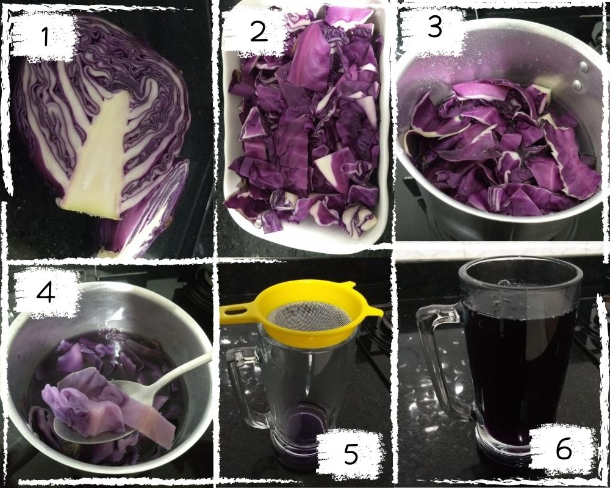

# Laboratório de cores

## Modo de preparo

### Chá de repolho roxo
* 1- Cortar repolho ao meio (vamos usar apenas uma metade)
* 2- Picar em tirinhas
* 3- Adicionar água e levar ao fogo
* 4- Deixar por mais ou menos 15min. (ou ate perder a cor, igual na imagem)
* 5- Coar
* 6- Reservar na galedeira até a hora do laboratório :)

### Ingredientes 
* Repolho ROXO
* Limão ou laranja
* Vinagre

OBS: A falta de algum ingrediente (exceto o repolho roxo) não afeta o andamento da oficina
