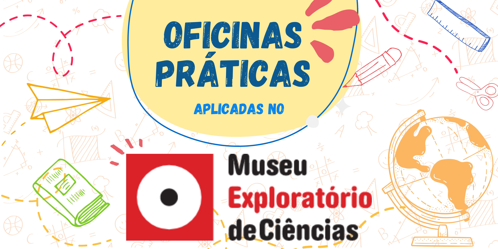

Oficinas desenvolvidas ou aplicadas no Museu Exploratório de Ciências da Unicamp.

## Oficinas Práticas

||
|:-----:|
|Através de diferentes disciplinas e tecnologias, o método e a construção do conhecimento científico são trabalhados em nossas oficinas.|

### Biologia
* [EcoEsfera](ecoesfera/)
* [A Evolução de Avis papyrus](papyrus/)
* [De Onde Esse Bicho Vem?](bicho/)
* [Mensagens na Garrafa](mensagemgarrafa/)
* [Investigando os Limites da Vida](levedura/)
  * [Material para Educadores](treinamento-levedura/)   

### Física
* [Aviões de Papel](avioes/)
* [Aviões de Material Reciclável](aviaomaker/)
* [Foguetes de Cartolina](foguetes/)
* [Mensagens na Luz - Espectrômetro Caseiro](espectrometro/)
* [Planet Hunters](planet/)
* [Como os instrumentos funcionam? - A Ciência por trás da música](musica/)

### Química
* [Laboratório de Cores](quimica-cores/)

### Geografia
* [A História de um Fóssil](fossil/)
* [Explorando Mapas e Desenhando o Mundo](mapas/)

### História
* [Restaurando a Arte e Desvendando a História Antiga (Temporada Encerrada - Indisponível)](anfora/)

### Matemática
* [Mundo dos Bloquinhos](bloquinhos/)
* [Explorando a Matemática dos Jogos](jogosmatematica/)

### Programação
* [Oficina Maker de Aplicativos](appmaker/)
* [Máquinas que Aprendem: Júnior e Avançado](ml/)

## Oficinas de Simulação

### Autômatos Celulares
* [Básico](simula/automatos/)
* [Máquinas Voadoras](https://bit.ly/museu-fly2)

### Equilíbrio Ecológico
* [Simulando Micro-organismos e o Equilíbrio da Vida](https://bit.ly/museu-micro)
* [Aquario Virtual](simula/aquarium-plus/)
* [Cerrado](simula/cerrado/)
* [Boids](https://bit.ly/museu-boids)

### Vírus e Contaminação
* [Simulando um Vírus para entender Doenças](simula/contagion/)

### Simulação Física
* [Simulando a trajetória de foguetes](simula/simufoguete/)

### Inferências em Saúde
* [Zombie Venom](https://bit.ly/museu-zumbi)

## Este site foi escrito em Markdown

Veja como usá-lo neste link: [Markdown](docs/).
