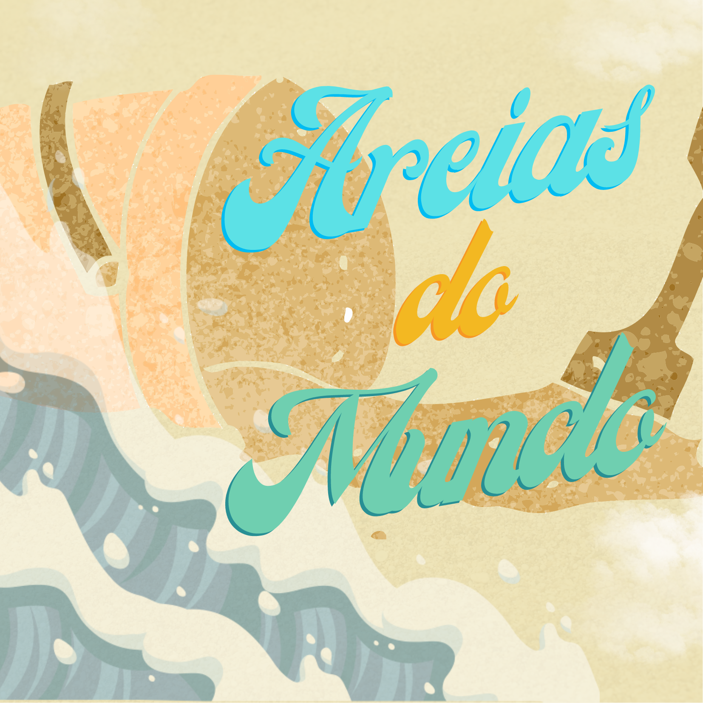

Oficinas desenvolvidas ou aplicadas no Museu Exploratório de Ciências da Unicamp.

## Oficinas Práticas

||
|:-----:|
|Através de diferentes disciplinas e tecnologias, o método e a construção do conhecimento científico são trabalhados em nossas oficinas.|

**OBS:** Clique na imagem para saber mais sobre a oficina.

|Praça Tempo Espaço|
|:------:|
||

|Fabrica 3D e a ciência dos biscoitos|
|:------:|
||

### Biologia

|EcoEsfera|A Evolução de Avis papyrus|
|:------:|:----:|
|||
|**De Onde Esse Bicho Vem?**|**Investigando os Limites da Vida**|
|||
||  [Material para Educadores - Investigando os Limites da Vida](treinamento-levedura/) |

### Ciências Ambientais

|Mensagens na Garrafa|
|:------:|
||

### Física

|Super Aviões de Papel|Maker de Aviões - Aviões de Material Reciclável|
|:------:|:----:|
|||
|**Foguetes de Cartolina**|**Mensagens na Luz - Espectrômetro Caseiro**|
|||
|**Planet Hunters**| **A Ciência por trás da música**|
|||
|**Lançamento de Foguetes**|**Aterrissagem Interplanetária**|
|||

### Química

|Laboratório de Cores|
|:------:|
||

### Geografia

|A História de um Fóssil|Explorando Mapas e Desenhando o Mundo|
|:------:|:----:|
|||
|**A descoberta de um Fóssil**|**Areias do mundo**|
|||
|**Navegação e Campos Magnéticos**|**Uma Viagem pelo Globo e suas Eras**|
|||

### Matemática

|Mundo dos Bloquinhos|Explorando a Matemática dos Jogos|
|:------:|:----:|
|||

### Programação

|Maker de Aplicativos|Máquinas que Aprendem: Júnior e Avançado|
|:------:|:----:|
|||

### História
* [Restaurando a Arte e Desvendando a História Antiga (Temporada Encerrada - Indisponível)](anfora/)

## Oficinas de Simulação

### Equilíbrio Ecológico

|Simulando Micro-organismos e o Equilíbrio da Vida|
|:------:|
||

|Aquario Virtual|Simulando o Equilíbrio da Vida - Cerrado|
|:------:|:------:|
|||

### Vírus e Contaminação

|Simulando um Vírus para entender Doenças|
|:------:|
||

### Simulação Física

|Simulando a trajetória de foguetes|
|:------:|
||

### Inferências em Saúde

|Zombie Venom|
|:------:|
||

### Autômatos Celulares
* [Básico](simula/automatos/)
* [Máquinas Voadoras](https://bit.ly/museu-fly2)

## Este site foi escrito em Markdown

Veja como usá-lo neste link: [Markdown](docs/).
