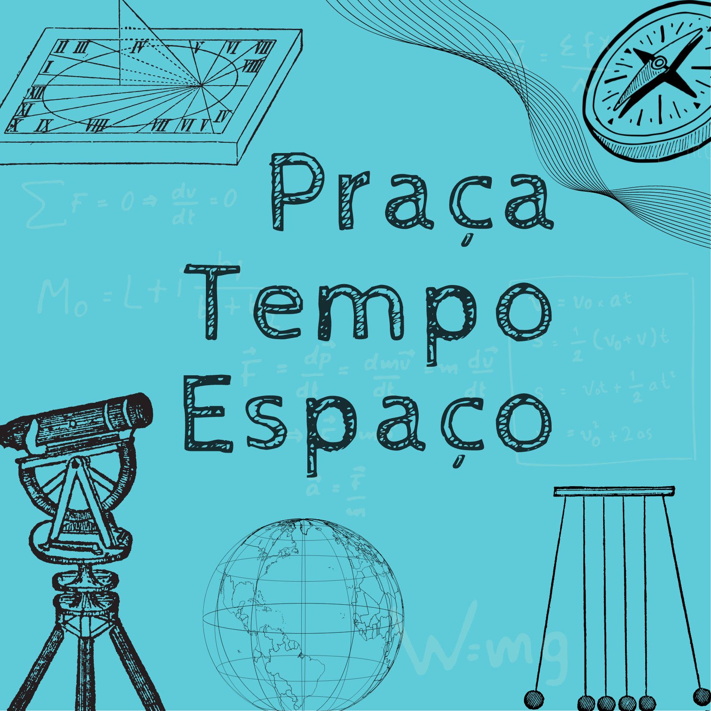
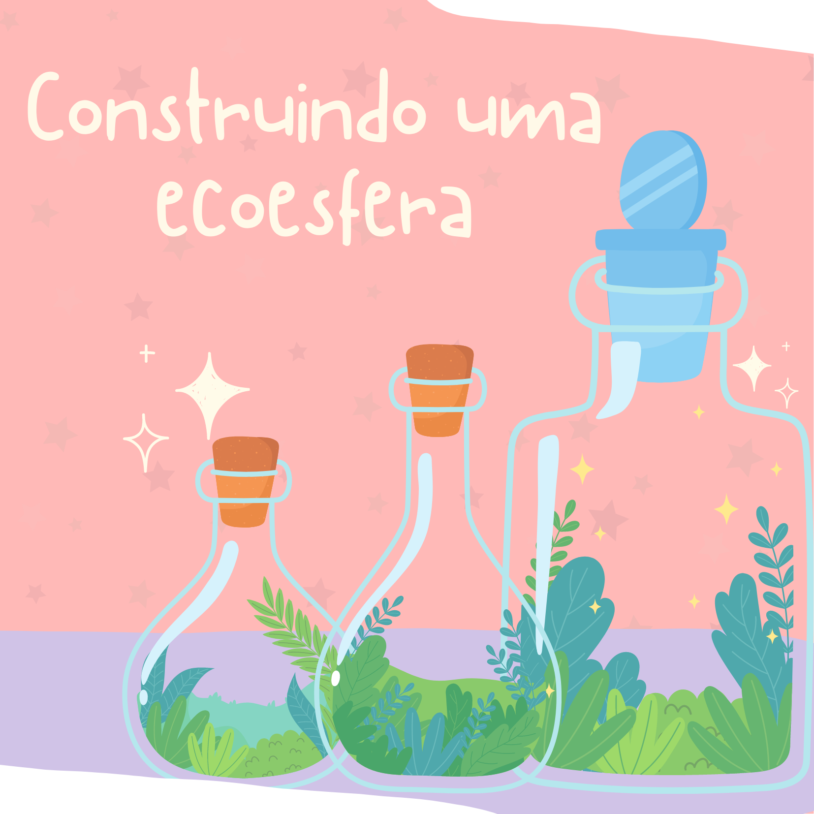
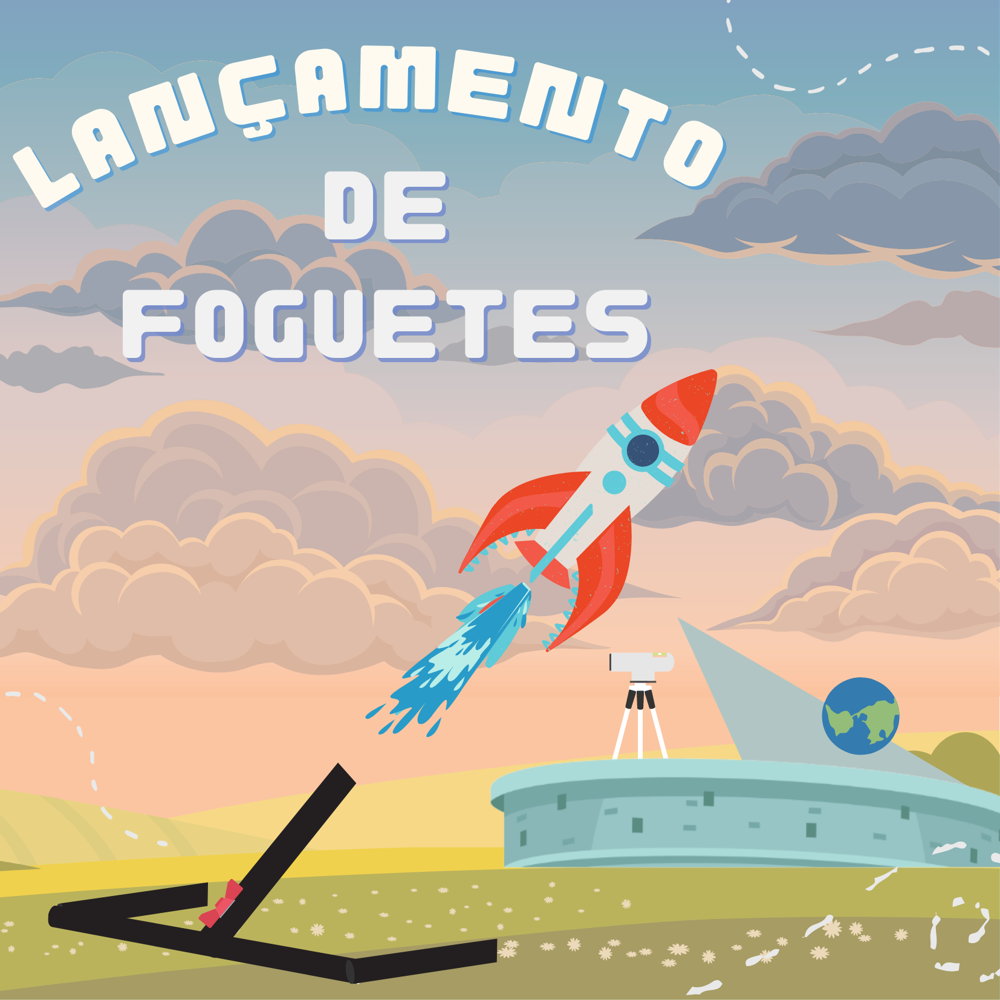
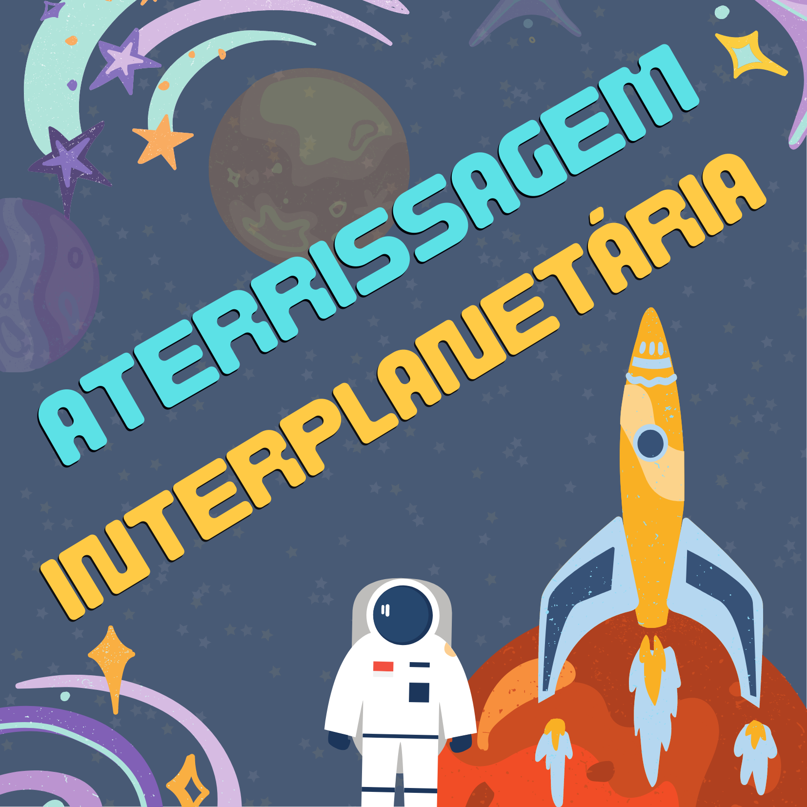
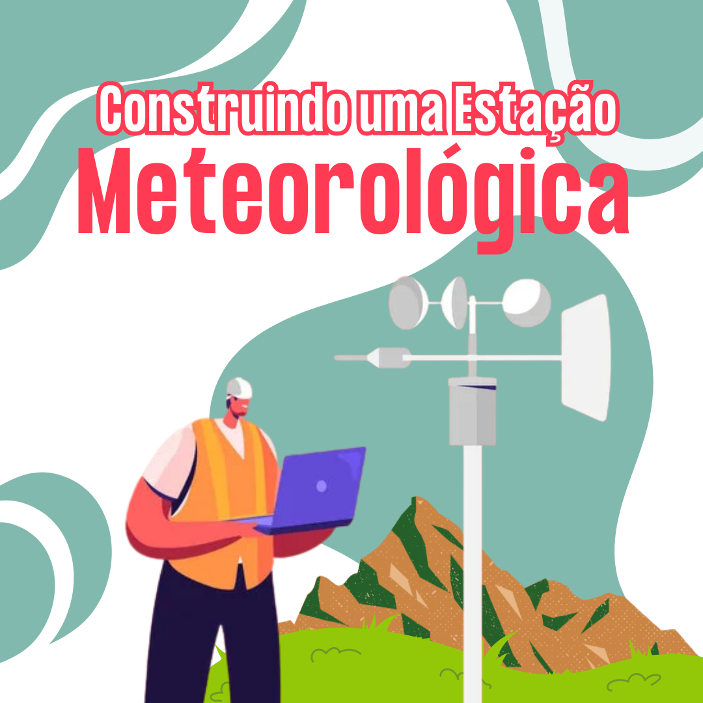

Oficinas desenvolvidas ou aplicadas no Museu Exploratório de Ciências da Unicamp.

## Oficinas Práticas

||
|:-----:|
|Explore o  mundo da ciência através das nossas oficinas com abordagem prática e interativa! 
Nosso catálogo oferece uma variedade de experiências educacionais que vão desde experimentos práticos até a exploração de novas tecnologias. Ao participar das nossas oficinas, as crianças terão a oportunidade de desenvolver habilidades de pensamento crítico, colaboração e resolução de problemas utilizando o método científico de forma divertida. |

**OBS:** Clique na imagem para saber mais sobre a oficina.

## Oficinas oferecidas nesta temporada

|Praça Tempo Espaço|
|:------:|
||

### Biologia

|**Construindo uma EcoEsfera**|**Investigando os Limites da Vida**|
|:------:|:----:|
|||

### Física

|**Lançamento de Foguetes**|**Aterrissagem Interplanetária**|
|:------:|:------:|
|||

### Geociências

|**Construindo uma Estação Meteorológica**|
|:------:|
||

|**Estação Meteorológica e Educação Climática**|
|:-----------------------------------:|
||
---

## Este site foi escrito em Markdown

Veja como usá-lo neste link: [Markdown](docs/).

  <a href="https://www.facebook.com/mcunicamp/">
     
  <a href="https://www.instagram.com/mcunicamp/">
     
  <a href="https://www.tiktok.com/@mcunicamp">
    

