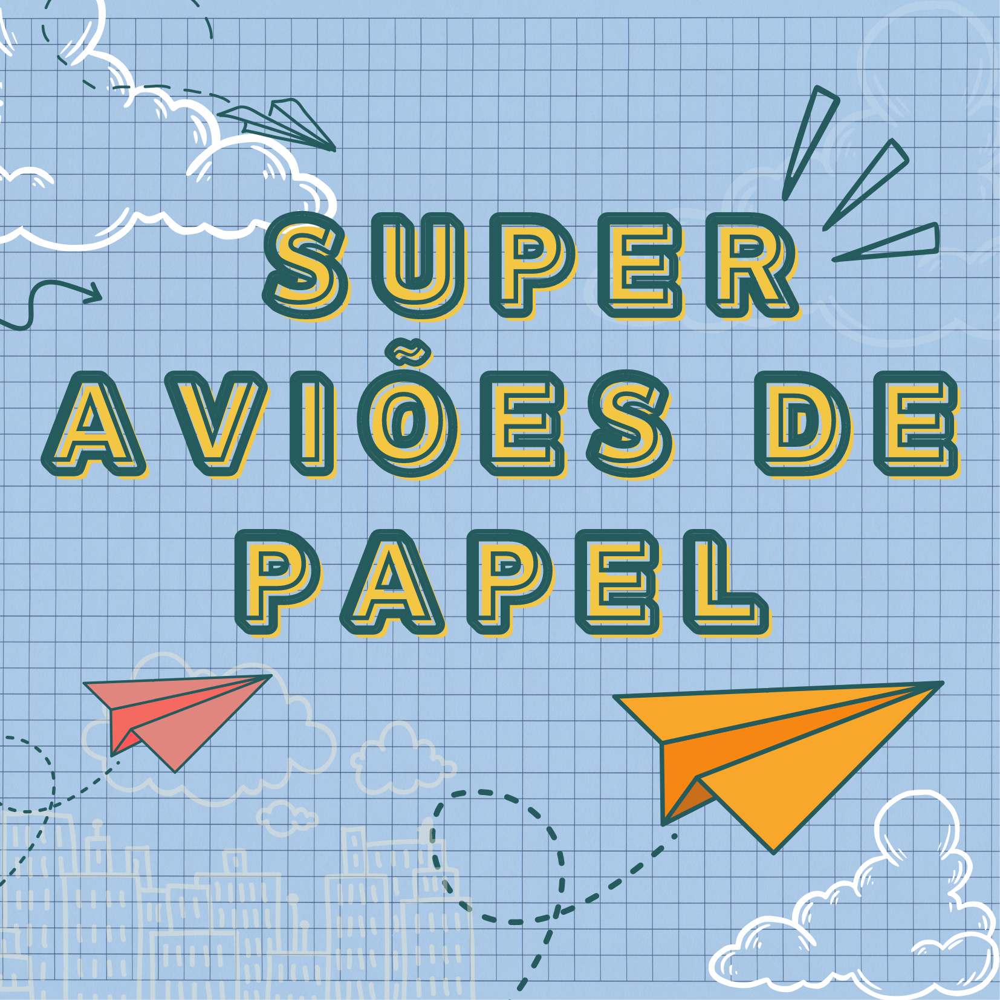

Oficinas desenvolvidas ou aplicadas no Museu Exploratório de Ciências da Unicamp.

## Oficinas Práticas

||
|:-----:|
|Através de diferentes disciplinas e tecnologias, o método e a construção do conhecimento científico são trabalhados em nossas oficinas.|

**OBS:** Clique na imagem para saber mais sobre a oficina.

## Oficinas que estão sendo oferecidas nesta temporada

|Praça Tempo Espaço|
|:------:|
||

|Estação Meteorológica|
|:------:|
||

|Fabrica 3D e a ciência dos biscoitos|
|:------:|
||

### Biologia

|**Construindo uma EcoEsfera**|
|:------:|
||
|**A Evolução de _Avis papyrus_**|
|
|**Investigando os Limites da Vida**|
||
|[Material para Educadores - Investigando os Limites da Vida](treinamento-levedura/) |

### Ciências Ambientais

|Mensagens na garrafa|
|:-----:|
||

### Física

|Super Aviões de Papel|Maker de Aviões - Aviões de Material Reciclável|
|:------:|:----:|
|||
|**Foguetes de Cartolina**|**Mensagens na Luz - Espectrômetro Caseiro**|
|||
| **A Ciência por trás da música**|
||
|**Lançamento de Foguetes**|**Aterrissagem Interplanetária**|
|||

### Química

|Laboratório de Cores|
|:------:|
||

### Geociências

|**A História de um Fóssil**|
|:------:|:----:|
||
|**A descoberta de um Fóssil**|**Rolling Stone - O Mistério das Areias**|
|||

|Construindo uma Estação Meteorológica|
|:-----:|
||

### Matemática

|Mundo dos Bloquinhos|Explorando a Matemática dos Jogos|
|:------:|:----:|
|||

### Programação

|Maker de Aplicativos|Máquinas que Aprendem: Júnior e Avançado|
|:------:|:----:|
|||

## Oficinas de Simulação

### Equilíbrio Ecológico

|Simulando Micro-organismos e o Equilíbrio da Vida|
|:------:|
||

|Construindo seu Aquário Virtual|Simulando o Equilíbrio da Vida - Cerrado|
|:------:|:------:|
|||

### Vírus e Contaminação

|Simulando um Vírus para entender Doenças|
|:------:|
||

### Simulação Física

|Simulando a trajetória de foguetes|
|:------:|
||

### Inferências em Saúde

|Zombie Venom|
|:------:|
||

## Oficinas que não estão sendo oferecidas nesta temporada

|**De Onde Esse Bicho Vem?**|
|:------:|
||
|**Planet Hunters**|
||
|**Explorando Mapas e Desenhando o Mundo**|
|
|**Navegação e Campos Magnéticos**|
||
|**Uma Viagem pelo Globo e suas Eras**|
|

## Este site foi escrito em Markdown

Veja como usá-lo neste link: [Markdown](docs/).

  <a href="https://www.facebook.com/mcunicamp/">
     
  <a href="https://www.instagram.com/mcunicamp/">
     
  <a href="https://www.tiktok.com/@mcunicamp">
    

