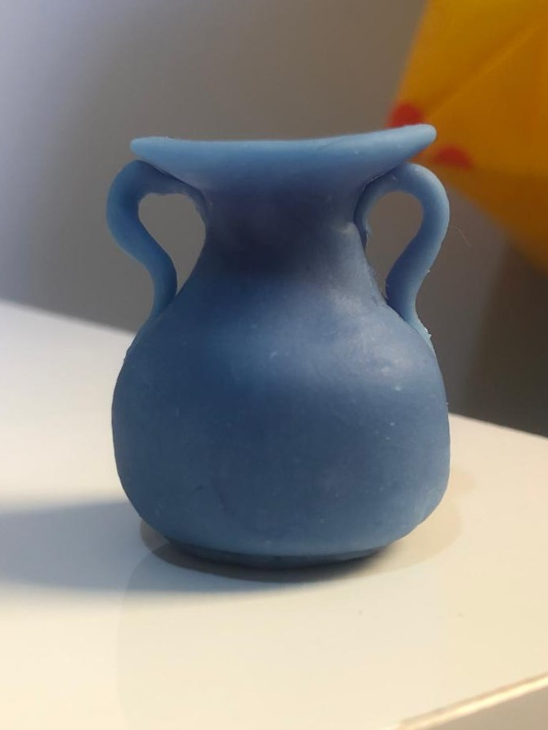

# Restaurando a Arte e Desvendando a História Antiga 🏺

#### Você sabia que o nosso conhecimento sobre o mundo antigo é resultado do minucioso trabalho dos historiadores?

## Apresentação

Nessa oficina, você será apresentado(a) aos fundamentos da pesquisa histórica e, na sequência, colocará a mão-na-massa! Massinha de biscuit, para ser exato. Sim, faremos juntos um modelo caseiro de ânfora - tipo de vaso usado pelos antigos gregos e romanos -  aplicando algumas técnicas de restauração sobre a peça.

Descubra como atuam os especialistas que buscam em diversas fontes os elementos que contam a trajetória humana no tempo, analisando e desvendando informações do passado para instruir o presente.

Entenda a importância do processo de restauração de fontes danificadas pela ação do tempo (como esculturas, pinturas, obras arquitetônicas, utensílios do cotidiano) e o trabalho cuidadoso para preservar e revelar seus significados.

## Faixa Etária

Faixa etária indicada: 8 a 11 anos

(A equipe do Museu adora um desafio! Caso deseje agendar essa oficina para outra faixa etária, entre em contato que podemos trabalhar juntos em uma adequação de conteúdo.)

## Material para Massinha de Biscuit

* Cola branca líquida, rótulo azul (tubo cheio-100g)
* Amido de milho (2 xícaras)
* Vinagre branco (1 colher de sopa)
* Vaselina líquida (1 colher de sopa) - * tem na farmácia
* Creme hidratante (para untar as mãos)
* Papel filme
* Tinta guache 
* Pincel

## Autoras 

Essa oficina foi idealizada e desenvolvida por alunas de graduação durante uma disciplina de estágio no Museu.

**[Janaína da Silva Fonseca](https://www.linkedin.com/in/jana%C3%ADna-da-silva-fonseca-b80979144)** 

**[Júlia Martins Portugal](https://www.instagram.com/julia.mportugal/)** 
[✉️](mailto:julia.mportugal98@gmail.com)

**[Leticia Daniele Diniz Vitor](https://www.instagram.com/lehdiniz22/)**
[✉️](mailto:leticiaddiniz22@gmail.com)
