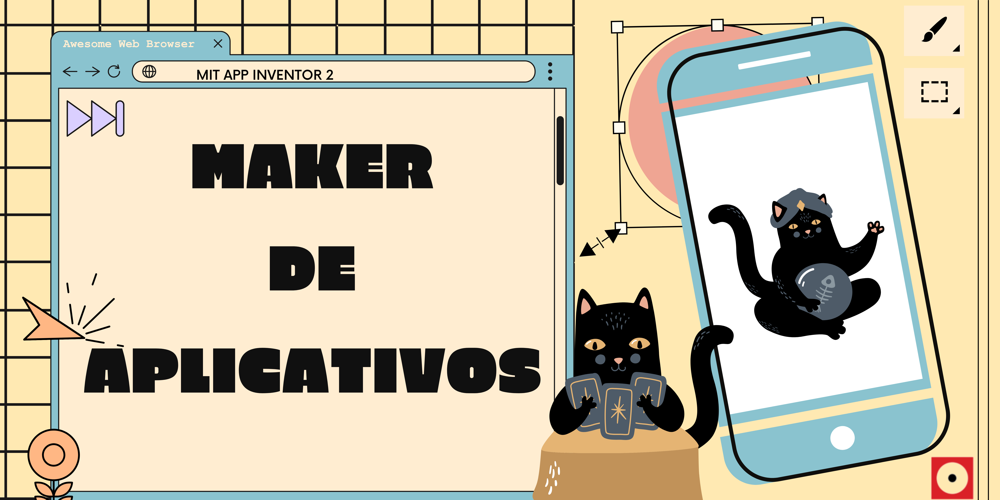
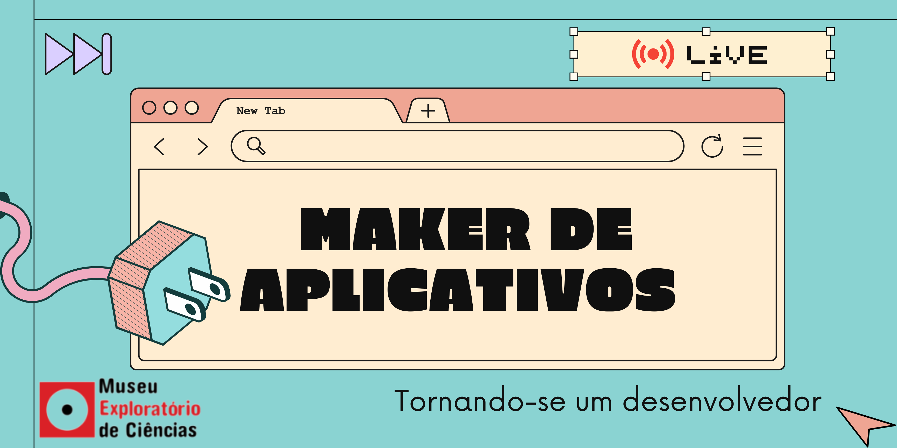

# Oficina Maker de Aplicativos

| |
| :---:|
||

Você vira seu celular e a fotografia gira. Seu dedo toca na tela e seu jogo emite um som de explosão.

Você já se perguntou como tudo isso é possível?

Nessa oficina você vai explorar o fascinante mundo da programação e controlar algumas das tecnologias mais incríveis que existem dentro do seu aparelho celular.

Torne-se você também um inventor de aplicativos!

## Faixa Etária

|Faixa etária indicada: à partir de 11 anos||
| :----: | :-------: |
|(A equipe do Museu adora um desafio! Caso deseje agendar essa oficina para outra faixa etária, entre em contato que podemos trabalhar juntos em uma adequação de conteúdo.)||

## Preparando-se para a Oficina

Para ter acesso à plataforma de programação, será necessária uma conta (login e senha) do Google Gmail.

Caso o participante já tenha uma conta, não é necessário criar uma nova (pode usar uma conta do pai ou da mãe, por exemplo).

Fique à vontade para explorar e testar com antecedência o acesso ao site do MIT App Inventor: [ai2.appinventor.mit.edu/](http://ai2.appinventor.mit.edu/)

Durante a oficina, os alunos desenvolverão aplicativos que poderão ser testados somente em smartphones e tablets com sistema operacional **Android**.

Os aplicativos são executados de maneira segura, sem risco de dano aos aparelhos.

Caso o(a) participante não tenha um aparelho com sistema operacional **Android**, será possível realizar 
as atividades normalmente, mas não será possível testá-lo. 

É possível encaminhar o aplicativo por e-mail para posterior instalação em dispositivo Android.

Para que os aplicativos desenvolvidos pelos alunos possam ser executados no dispositivo é necessária a instalação prévia do aplicativo MIT AI2 Companion disponível no Google Play.

Recomendamos que o aplicativo seja instalado **antes da oficina!**

## Vídeo da oficina

|_clicar na imagem para ser redirecionado ao vídeo_||
|:-------------:|:-------------:|
|||

## Para mais informações entre em contato
* Por email museu@unicamp.br
* Ou acesse o [Site oficial do Museu](https://www.mc.unicamp.br/visite)
