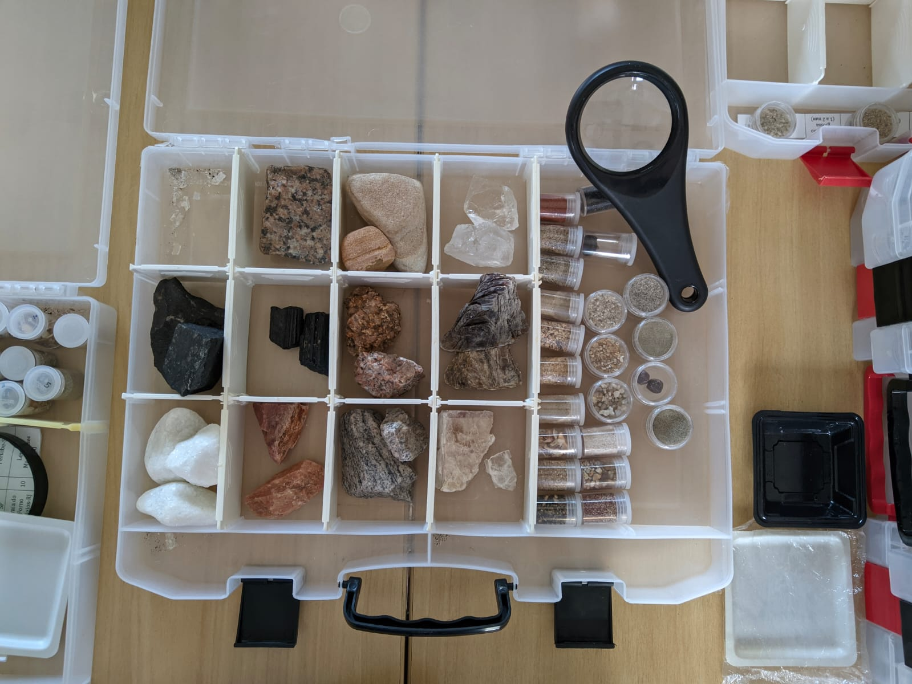
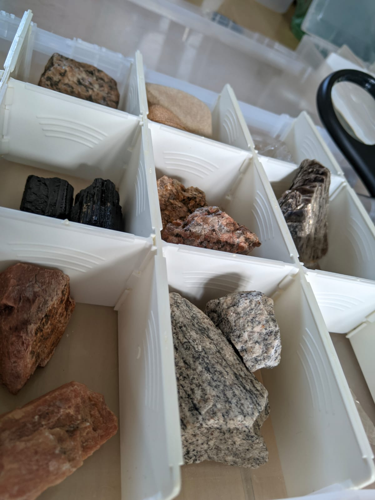

# Areias do Mundo

||
|-----|
|O mundo microscópico das areias e suas origens! Areia da praia, areia do parquinho, areia de construção. Você sabe de onde toda essa areia vem? Sabe do que ela é composta? Já reparou que a areia por ser clara, escura, grossa, fina, de cores diferentes? Preparamos para você uma oficina em que você entenderá como a areia é formada e será capaz de criar areia com o seu estilo.|

### Faixa Etária

Faixa Etária indicada: 8 a 12 anos

|||
|------|------|
|||

## Para mais informações entre em contato

* Por email museu@unicamp.br

* Ou acesse o [Site oficial do Museu](https://www.mc.unicamp.br/visite)
