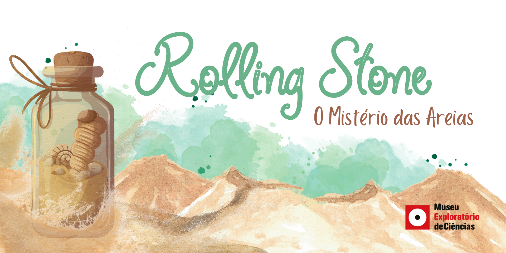

# Areias do Mundo

## Disponível para agendamento de oficinas PRESENCIAIS

|  |
|:-----:|
| O mundo microscópico das areias e suas origens! Areia da praia, areia do parquinho, areia de construção... Você sabe de onde toda essa areia vem? Sabe do que ela é composta? Já reparou que a areia por ser clara, escura, grossa, fina, de cores diferentes? Preparamos para você uma oficina em que você entenderá como a areia é formada e será capaz de criar areia com o seu estilo.|

## Faixa Etária

|Faixa Etária indicada: de 5 à 12 anos||
|:------:|:------:|
|(A equipe do Museu adora um desafio! Caso deseje agendar essa oficina para outra faixa etária, entre em contato que podemos trabalhar juntos em uma adequação de conteúdo.)||

## Conceitos abordados e Habilidades

Método científico, ciclo das rochas, composição das rochas, intemperismo e deposição de sedimentos, formação de hipóteses, análise e reflexão.

## Para mais informações entre em contato

* Por email museu@unicamp.br

* Ou acesse o [Site oficial do Museu](https://www.mc.unicamp.br/visite)
