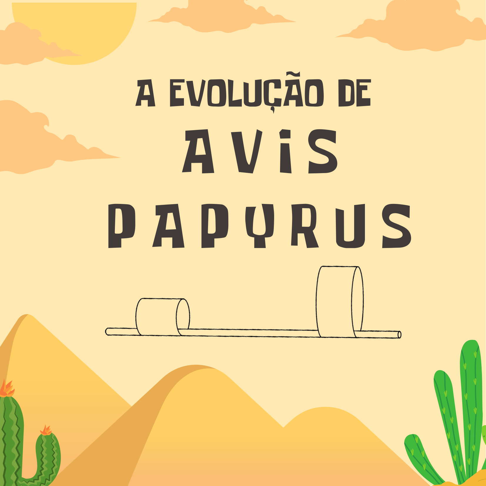
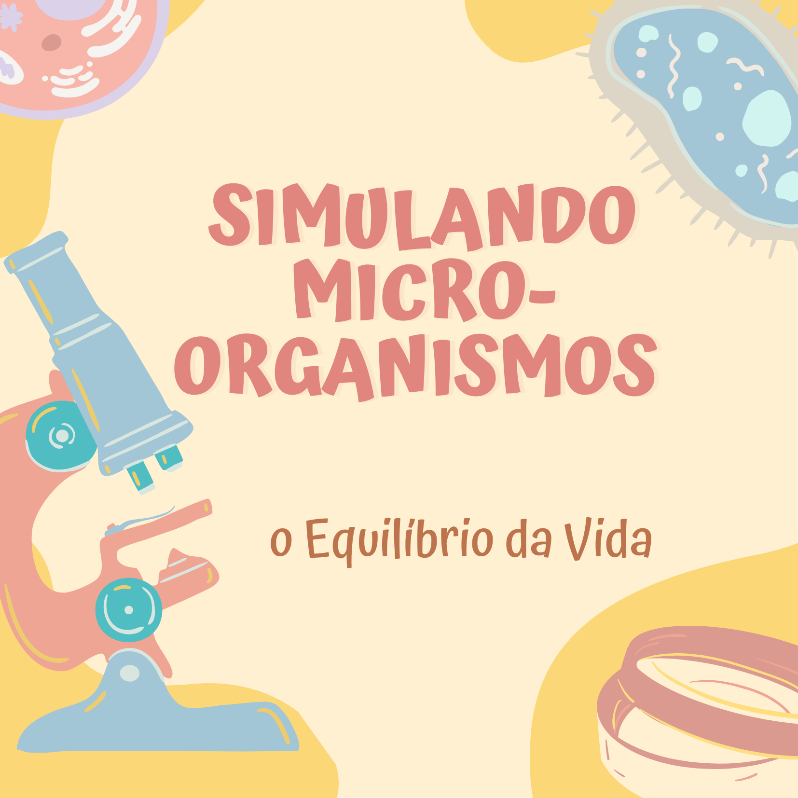
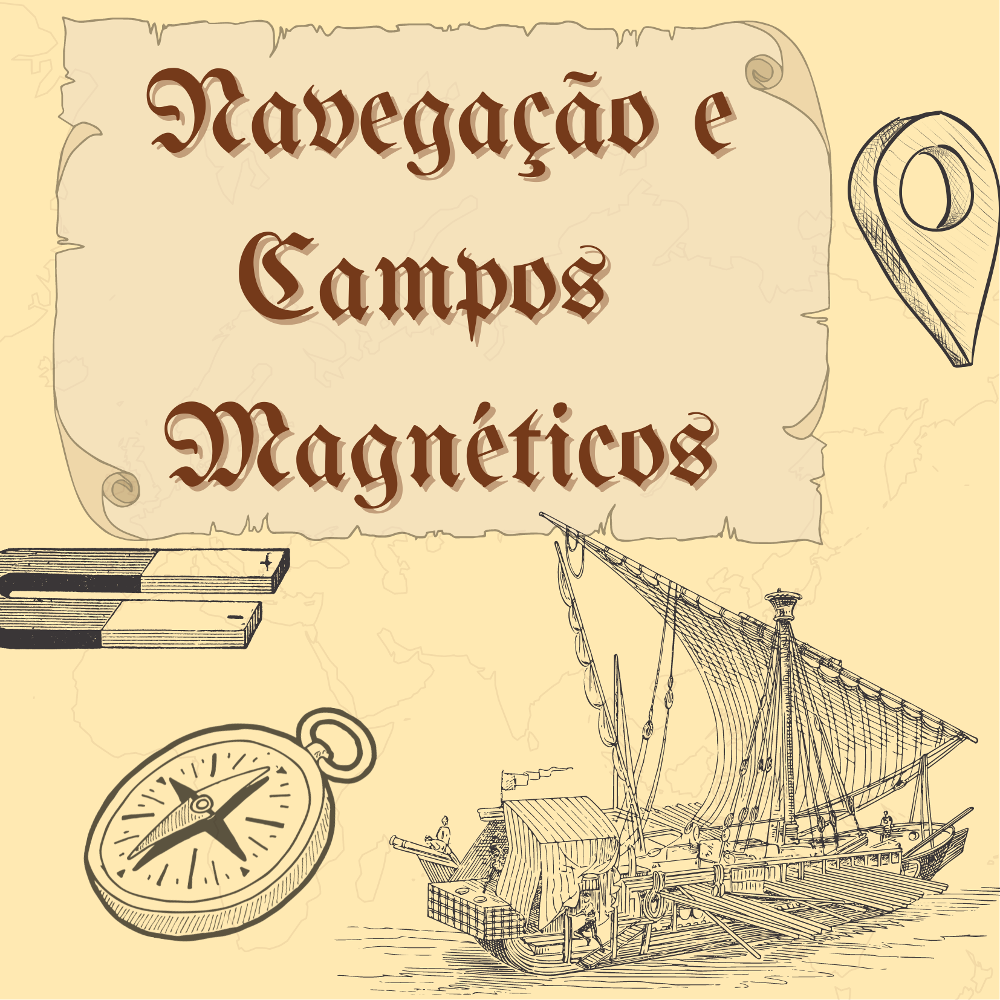
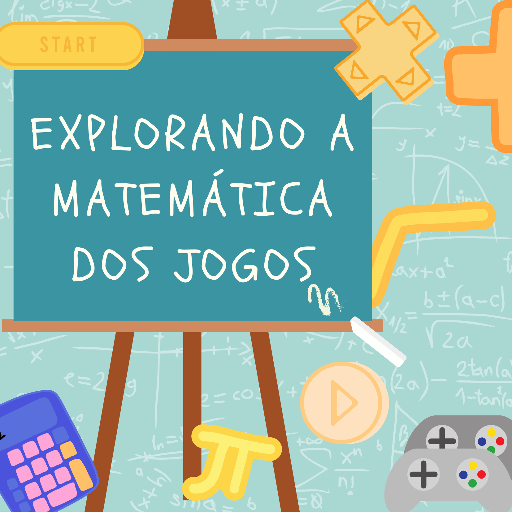
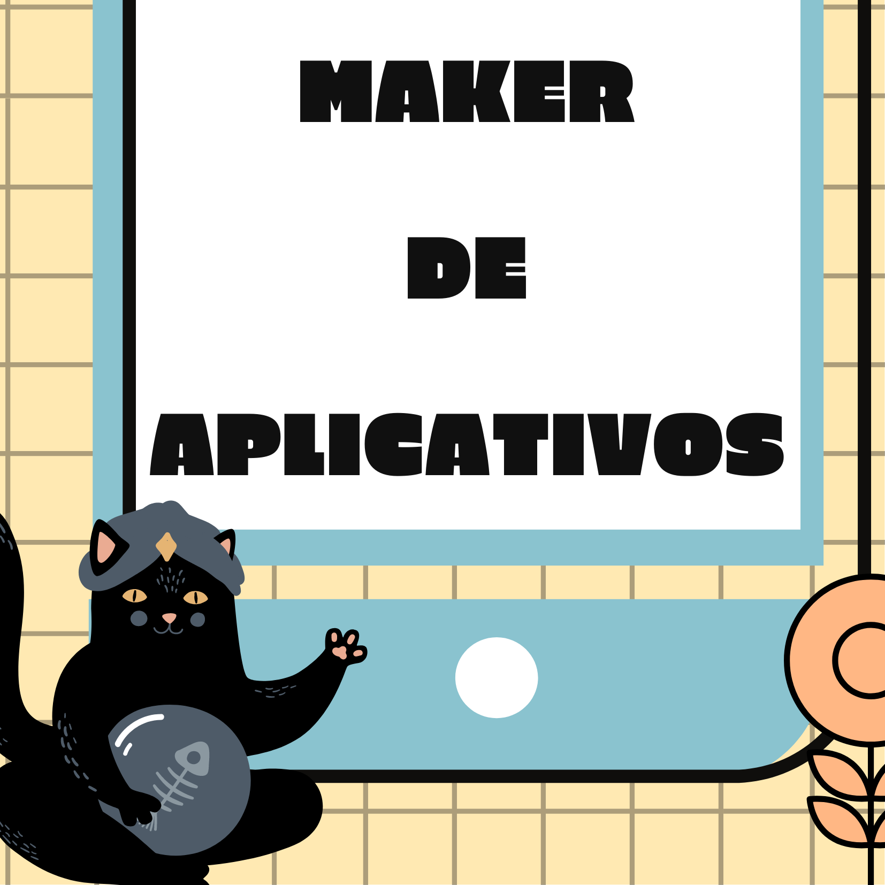

## Arquivo Histórico de Oficinas

Este é um arquivo de oficinas do Museu Exploratório de Ciências da UNICAMP para fins históricos. [Clique aqui](./) para conhecer as oficinas do Museu atualmente oferecidas.

## Oficinas Práticas

||
|:-----:|
|Explore o  mundo da ciência através das nossas oficinas com abordagem prática e interativa! 
Nosso catálogos oferece uma variedade de experiências educacionais que vão desde experimentos práticos até a exploração de novas tecnologias. Ao participar das nossas oficinas, as crianças terão a oportunidade de desenvolver habilidades de pensamento crítico, colaboração e resolução de problemas utilizando o metodo cientifico de forma divertida. |

**OBS:** Clique na imagem para saber mais sobre a oficina.

## Oficinas oferecidas nesta temporada

|Praça Tempo Espaço|Estação Meteorológica|
|:------:|:----:|
|||

### Biologia

|**Construindo uma EcoEsfera**|**A Evolução de _Avis papyrus_**|
|:------:|:----:|
|||
|**Investigando os Limites da Vida**|**Mensagens na garrafa**|
|||
|[Material para Educadores - Investigando os Limites da Vida](treinamento-levedura/) |Ciências Ambientais|

### Física

|Super Aviões de Papel|Maker de Aviões - Aviões de Material Reciclável|
|:------:|:----:|
|||
|**Foguetes de Cartolina**|**Mensagens na Luz - Espectrômetro Caseiro**|
|||
|**A Ciência por trás da música**|**Lançamento de Foguetes**|
|||

|**Aterrissagem Interplanetária**|
|:------:|
|

### Química

|**Laboratório de Cores**|**Fabrica 3D e a ciência dos biscoitos**|
|:------:|:------:|
|||
|  |Engenharia de Alimentos|

### Geociências

|**A História de um Fóssil**|**A descoberta de um Fóssil**|
|:------:|:----:|
|||
|**Rolling Stone - O Mistério das Areias**|**Construindo uma Estação Meteorológica**|
||

## Oficinas de Simulação

### Equilíbrio Ecológico

|Simulando Micro-organismos e o Equilíbrio da Vida|
|:------:|
||

|Construindo seu Aquário Virtual|Simulando o Equilíbrio da Vida - Cerrado|
|:------:|:------:|
|||

### Simulação Física

|Simulando a trajetória de foguetes|
|:------:|
||

### Inferências em Saúde

|Zombie Venom|
|:------:|
||

## Oficinas que não estão sendo oferecidas nesta temporada

|**De Onde Esse Bicho Vem?**|**Planet Hunters**|
|:------:|:------:|
|||
|**Explorando Mapas e Desenhando o Mundo**|**Navegação e Campos Magnéticos**|
||
|**Uma Viagem pelo Globo e suas Eras**|**Simulando um Vírus para entender Doenças**|
||

|Mundo dos Bloquinhos|Explorando a Matemática dos Jogos|
|:------:|:----:|
|||

|Maker de Aplicativos|Máquinas que Aprendem: Júnior e Avançado|
|:------:|:----:|
|||

## Este site foi escrito em Markdown

Veja como usá-lo neste link: [Markdown](docs/).

  <a href="https://www.facebook.com/mcunicamp/">
     
  <a href="https://www.instagram.com/mcunicamp/">
     
  <a href="https://www.tiktok.com/@mcunicamp">
    

