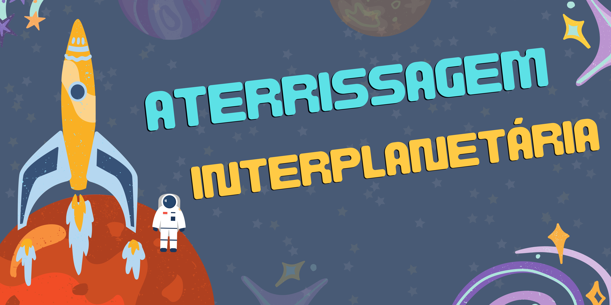
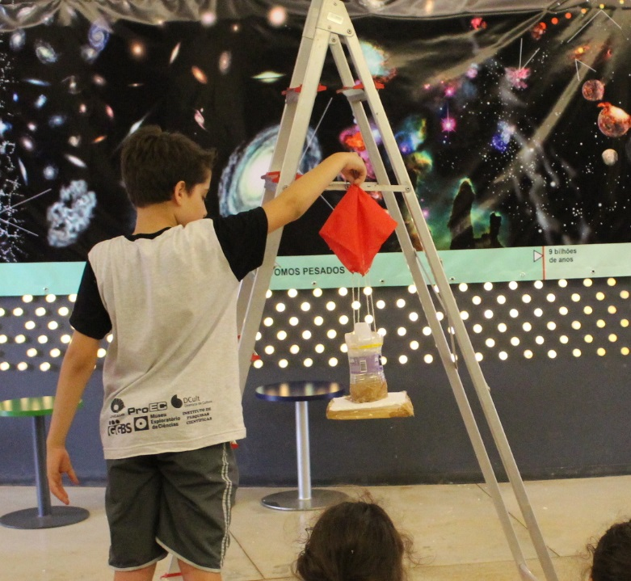
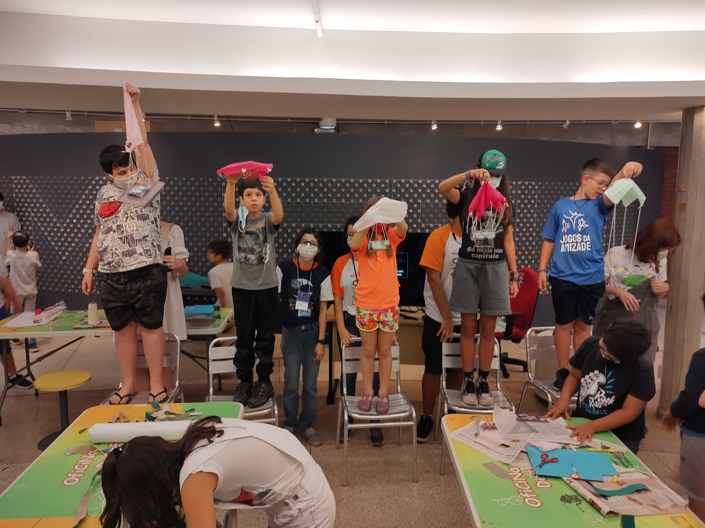

# Aterrissagem Interplanetária

## Oficina PRESENCIAL disponível para agendamento

|  |
|:-----:|
|Em equipes, os participantes devem projetar um protótipo de um módulo que deve pousar em um outro planeta. Cada equipe recebe um conjunto miniaturas que representam a tripulação que não pode cair do módulo na aterrissagem. Através do método científico os participantes devem refinar o modelo a cada teste, a fim de comprovar ou refutar suas hipóteses de melhoria e encontrar os pontos de otimização das variáveis envolvidas.|

## Faixa Etária

|Faixa Etária indicada: a partir de 7 anos||
|:------:|:------:|
|*(A equipe do Museu adora um desafio! Caso deseje agendar essa oficina para outra faixa etária, entre em contato que podemos trabalhar juntos em uma adequação de conteúdo.)*||

## Conceitos abordados e Habilidades
Método científico, equilíbrio de forças, centro de massa, formulação de hipóteses, experimentação e trabalho em equipe.

|||
|:------:|:------:|

## Para mais informações entre em contato

* Por email museu@unicamp.br

* Ou acesse o [Site oficial do Museu](https://www.mc.unicamp.br/visite)

  <a href="https://www.facebook.com/mcunicamp/">
     
  <a href="https://www.instagram.com/mcunicamp/">
     
  <a href="https://www.tiktok.com/@mcunicamp">
    
