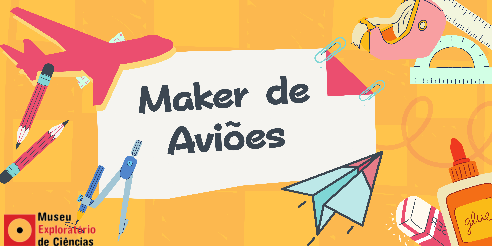

# Maker de Aviões - Aviões de Material Reciclável

## Oficina PRESENCIAL disponível para agendamentos

| |
| :-----:|
|Projete e construa aviões mais elaborados seguindo o passo a passo apresentado na oficina. A cada etapa, você conhecerá detalhes sobre conceitos básicos de Física e métodos científicos utilizados no aperfeiçoamento da construção e do voo das aeronaves.|

## Faixa Etária

Faixa etária indicada: 9 a 14 anos

*(A equipe do Museu adora um desafio! Caso deseje agendar essa oficina para outra faixa etária, entre em contato que podemos trabalhar juntos em uma adequação de conteúdo.)*

## Conceitos abordados e habilidades

Método científico, natureza e aviação, resistência do ar, equilíbrio de forças, centro de massa, experimentação.

## Materiais

* Lapís
* Régua
* Borracha
* Tesoura
* Papelão
* Bandeja de isopor

## Para mais informações entre em contato

* Por email: museu@unicamp.br
* Ou acesse o [Site Oficial do Museu](https://www.mc.unicamp.br/visite)
