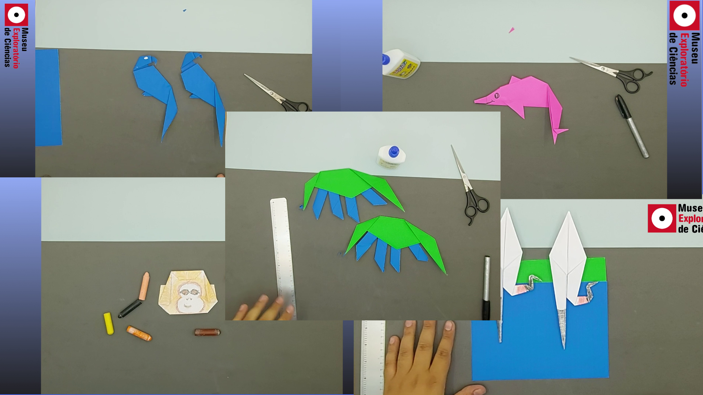

# De onde esse Bicho vem?

## Biomas do Brasil

> "Bioma - Grande conjunto de vida vegetal e animal caracterizado pelo tipo de vegetação dominante” 

Essa é a definição de Bioma encontrada no IBGE, mas será que é só isso mesmo? Que tal utilizarmos uma ferramenta de visualização de imagens de satélite para conhecer e explorar os diferentes biomas brasileiros, e entender o que essa definição significa. Utilizando o [Google Earth](https://earth.google.com/) vamos embarcar nessa viagem pelo Brasil!

O clima, altitude, vegetação, solo e tantas outras características, impactam diretamente na vida vegetal e animal, mas será que conseguimos descobrir qual(is) bioma(s) um animal habita apenas com essas caracteríscias? A segunda parte, que dá nome a oficina, consiste em descobrir o animal de origami que estamos fazendo e criar hipóteses sobre qual o seu habitat, compreendendo assim a delicada relação entre o meio ambiente e os seres vivos.

## Faixa Etária
Faixa etária indicada: acima de 10 anos.

(A equipe do Museu adora um desafio! Caso deseje agendar essa oficina para outra faixa etária, entre em contato que podemos trabalhar juntos em uma adequação de conteúdo.)

## Tutoriais de Origamis

Para dar um gostinho de como é essa oficina, o Museu disponibilizou tutorais dos origamos em seu YouTube! A descrição de cada vídeo está recheada de informações e links interessantes, não esqueça de dar uma olhada lá ;)

_Para acessar a playlist basta clicar na imagem_

## Para saber mais!

[Biomas IBGE](https://geoftp.ibge.gov.br/informacoes_ambientais/estudos_ambientais/biomas/documentos/Sintese_Descricao_Biomas.pdf)

[Artigo científico sobre a definição de Bioma](https://www.scielo.br/scielo.php?script=sci_arttext&pid=S0102-33062006000100002)
