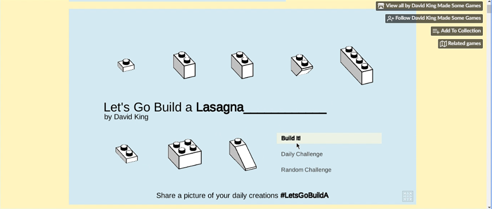

# Mundo dos Bloquinhos

Na oficina, utilizamos um programa simulador de bloquinhos de montar para identificar problemas em um projeto inadequado e, na sequência, você irá criar, desenvolver e aperfeiçoar o seu próprio projeto.
Mostre a sua habilidade criativa, explorando conceitos matemáticos, espaciais e aprofundando o conhecimento sobre frações.

Para ter acesso ao software usado na oficina é necessário apenas um computador, tablet ou smartphone com navegador atualizado. 
O simulador que utilizaremos é executado no próprio navegador, sem necessidade de instalação na máquina.
Observação: apesar do programa rodar em tablet e celular, pode haver algumas dificuldades pela falta de um mouse físico.

Acesso ao site com simulador: [Lets Go Biuld A...](https://dr-d-king.itch.io/lets-go-build-a)

## Como usar o simulador:

Ao abrir a página teremos um grande botão escrito "Run Game", clique nele.

O jogo irá carregar e entrará no menu principal. Teremos apenas duas opções, dayly challenge ou random challenge (desadio diário ou desafio aleatório), clique em qualquer um dos dois.

Uma palavra em inglês será sortedada, para a oficina não iremos usá-la, apenas ignore. Uma nova ooção irá surgir, Build it (construa), vamos clicar nela.

