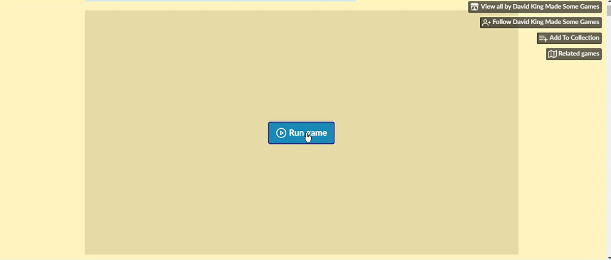
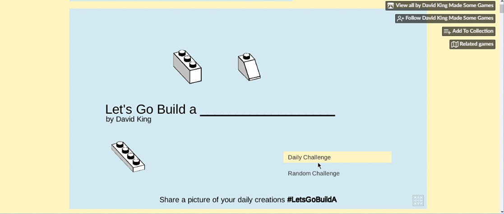
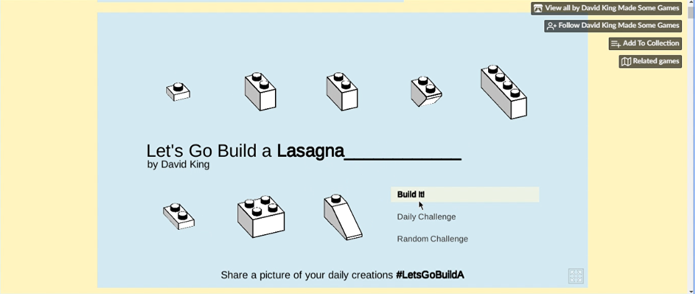
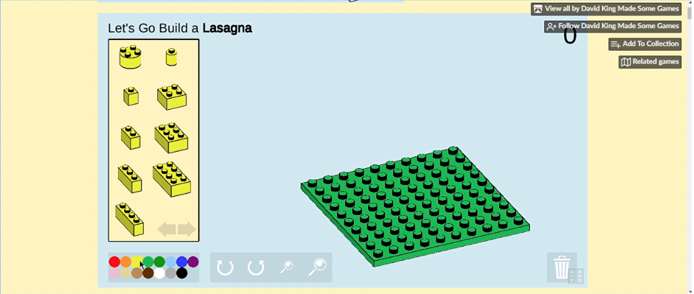
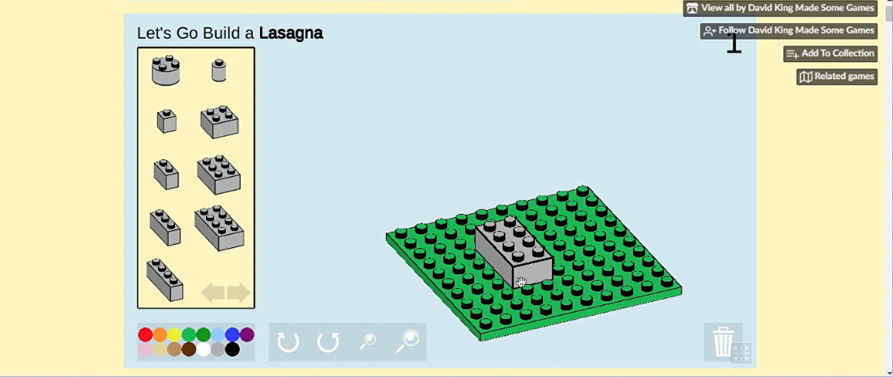
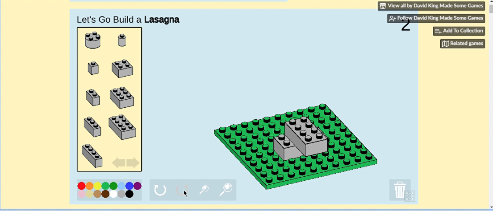

# Mundo dos Bloquinhos

Nesta oficina, utilizamos um programa simulador de bloquinhos de montar para identificar problemas em um projeto inadequado e, na sequência, você irá criar, desenvolver e aperfeiçoar o seu próprio projeto.
Mostre a sua habilidade criativa, explorando conceitos matemáticos, espaciais e aprofundando o conhecimento sobre frações.

Para ter acesso ao software usado na oficina é necessário apenas um computador, tablet ou smartphone com navegador atualizado. 
O simulador que utilizaremos é executado no próprio navegador, sem necessidade de instalação na máquina.
Observação: apesar do programa rodar em tablet e celular, pode haver algumas dificuldades pela falta de um mouse físico.

Acesso ao site com simulador: [Lets Go Biuld A...](https://dr-d-king.itch.io/lets-go-build-a)

Este simulador é bem bonito e prático, porém tem uma limitação de 20 peças por vez.

## Como usar o simulador:

Ao abrir a página teremos um grande botão escrito "Run Game", clique nele.

O jogo irá carregar e entrará no menu principal. Teremos apenas duas opções, daily challenge ou random challenge (desadio diário ou desafio aleatório), clique em qualquer um dos dois.

Uma palavra em inglês será sortedada, para a oficina não iremos usá-la, apenas ignore. Uma nova ooção irá surgir, Build it (construa), vamos clicar nela.

Agora temos a tela principal do aplicativo, vamos entender como usar a interface. Começando pelas cores das peças, basta apenas clicar na cor desejada na tabela abaixo das peças.

Além disso podemos usar peças diferentes também, podendo ser acessadas nas setas abaixo das peças. Temos uma sessão de peças normais primeiro, depois das "achatadas" e por último as de formas especiais, que geralmente não são usadas na oficina, mas fique a vontade para usá-las por diversão.

Depois de escolher a cor e o tipo da peça, para colocá-la na base basta clicar nela, segurar e arrastar até a posição desejada.

Também é possível virar as peças antes de colocar, basta enquanto segura o botão esquedo do mouse (o clique) apertar o direito também.

Caso você não tenho um mouse físico ou esteja em um dispositivo móvel não poderá fazer a manobra desse jeito, então terá que virar a base inteira no lugar das peças. Para isso basta usar os botões localizados ao lado da tabela de cores.

Por fim, se precisar excluir uma peça basta deixá-la fora da mesa. Porém, por vezes um bug acontece e isso não funciona, para resolver basta levar o mouse até o símbolo da lixeira no canto inferior direito e clicar nele.

Essas são as instruções básicas do simulador, divirta-se usando ele, principalmente com os desafios da oficina Mundo dos Bloquinhos!
