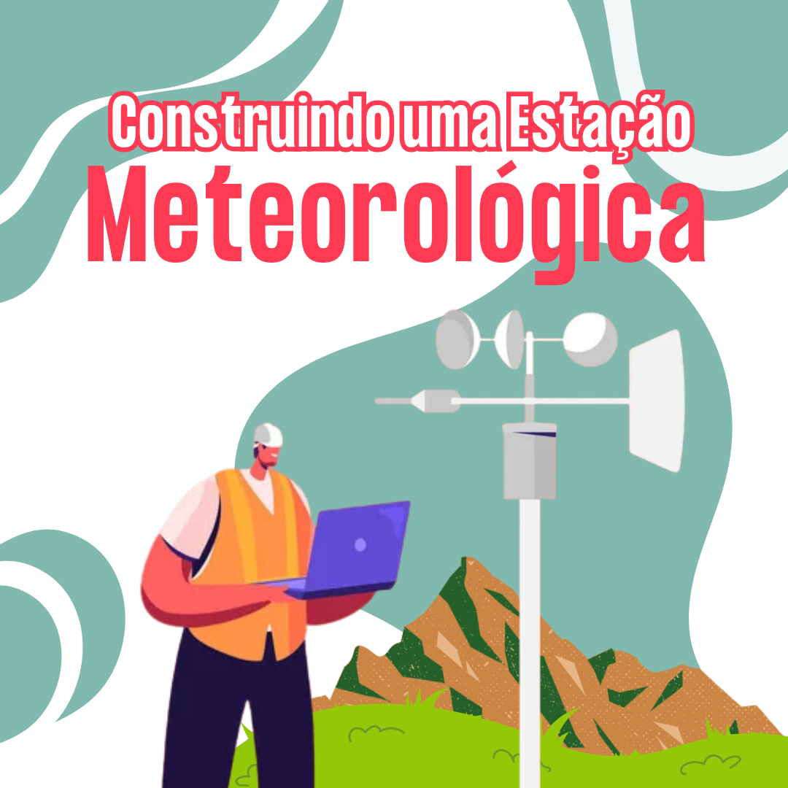

# Construindo uma Estação Meteorológica

| |
|:-------------:|
| Já pensou em possuir uma estação meteorológica? Poder medir a velocidade do vento e variações de temperatura na sua casa? Nesta oficina você irá aprender a construir seus próprios equipamentos de medição meteorológica, conhecendo o funcionamento destes instrumentos e das condições do tempo.|
 

## Faixa Etária

|Faixa etária indicada: ||
|:-------------:|:-------------:|
|*(A equipe do Museu adora um desafio! Caso deseje agendar essa oficina para outra faixa etária, entre em contato que podemos trabalhar juntos em uma adequação de conteúdo.)*| |

## Conceitos Abordados e Habilidades

## Materiais

## Autores

## Referências

## Para mais informações entre em contato

* Por email: museu@unicamp.br
* Ou acesse o [Site Oficial do Museu](https://www.mc.unicamp.br/visite)

