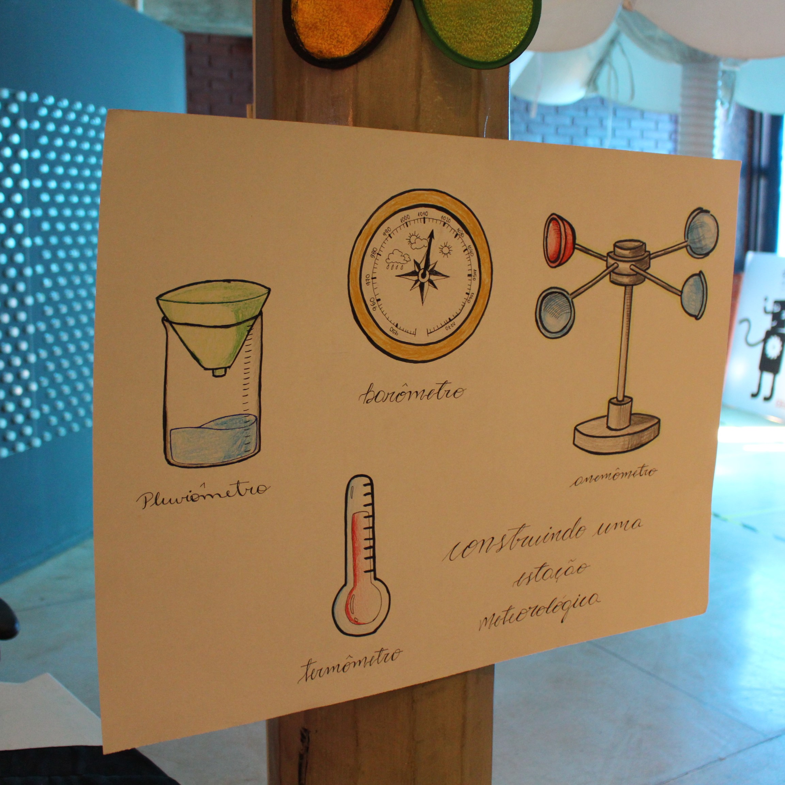

# Construindo uma Estação Meteorológica

## Oficina PRESENCIAL disponível para agendamento

| |
|:-------------:|
|Você sabe o que é uma Estação Meteorológica? E a diferença entre Clima e Tempo? As condições climáticas possuem diversas variáveis como: pressão atmosférica, temperatura, precipitação, vento, etc. Nesta oficina você irá aprender a construir seus próprios equipamentos de medição meteorológica, além de conhecer o funcionamento e os fenômenos físicos por trás deles.|

**Observação:** esta oficina é dividida em etapas, que correspondem a um equipamento de medição meteorológica específico. O agendamento corresponde a uma etapa desta oficina. *Porém, cada etapa é independente uma da outra*.

## Faixa etária

|Faixa etária indicada: 10 a 12 anos||
|:-------------:|:-------------:|
|*(A equipe do Museu adora um desafio! Caso deseje agendar essa oficina para outra faixa etária, entre em contato que podemos trabalhar juntos em uma adequação de conteúdo.)*| |

## Conceitos abordados e Habilidades

Método científico, conceitos de clima e tempo, grandezas meteorológicas, equipamentos de medição, habilidades motoras e trabalho em equipe.

## Materiais

### Anemômetro
* Canudos
* Tesoura
* Papel sulfite
* Canetinhas
* Fita
* Palito de churrasco
* Bolinhas coloridas de plástico cortadas ao meio
* Copos descartáveis

### Barômetro
* Água (quente e fria)
* Garrafas térmicas
* Canudos
* Tesoura
* Papel sulfite
* Canetinhas
* Fita
* Bexiga 
* Pote de vidro para conserva

### Pluviômetro
* Água
* Garrafas PET
* Régua
* Funil
* Fita
* Tesoura
* Algodão

### Termômetro
* Água (quente e fria)
* Garrafa Térmica
* Béqueres
* Garrafa pet 200ml
* Canudo
* Corante
* Ferro de solda
* Cola quente
* Fita adesiva
* Folha sulfite
* Canetinhas
* Tesoura

## Créditos

Esta oficina foi elaborada por [Natalia Diniz](http://lattes.cnpq.br/4378526938604586) em seu período como mediadora do Museu Exploratório de Ciências.

## Para mais informações entre em contato

* Por email: museu@unicamp.br
* Ou acesse o [Site Oficial do Museu](https://www.mc.unicamp.br/visite)

