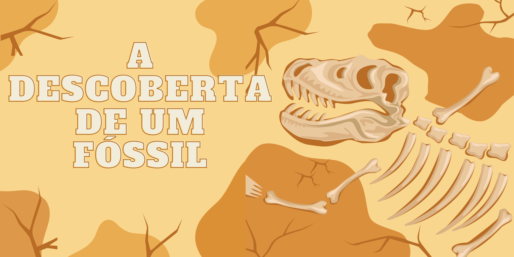
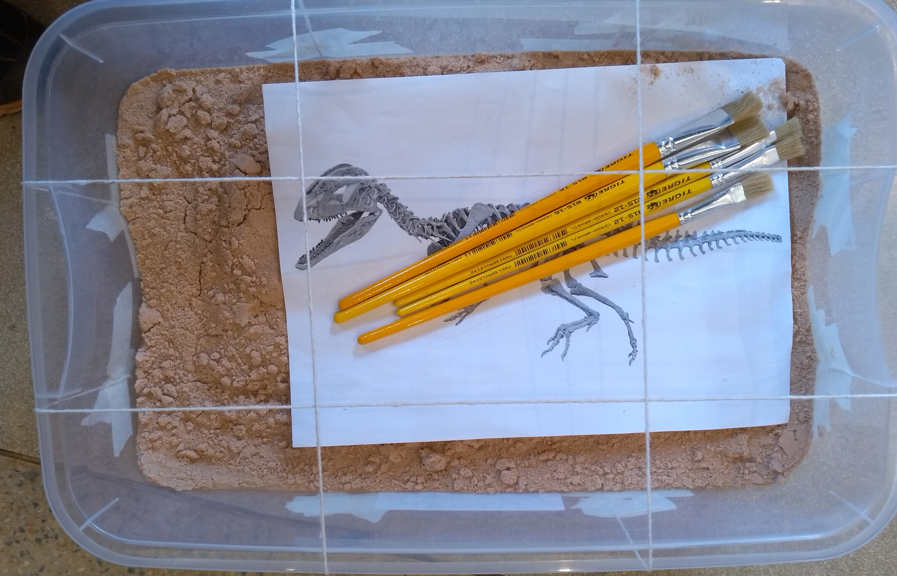
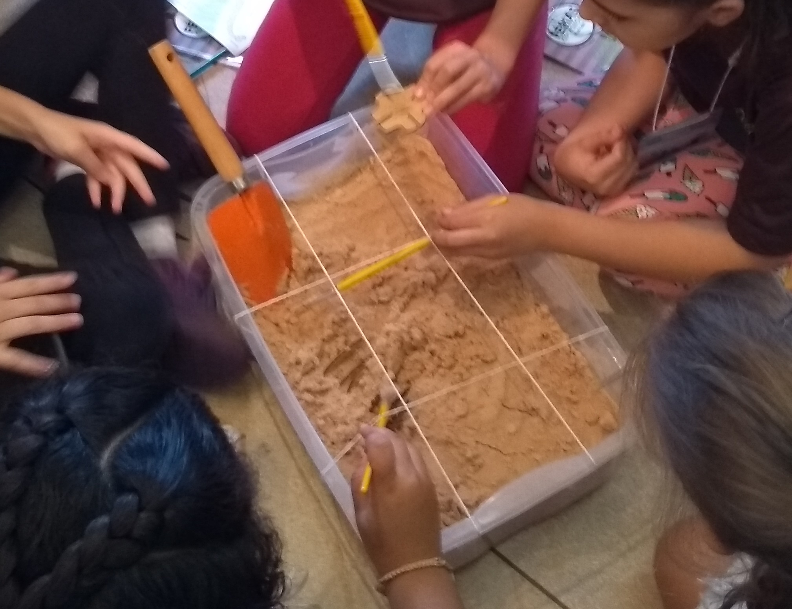

# A Descoberta de um Fóssil

## Oficina PRESENCIAL disponível para agendamento

||
|:--:|
|
Como um cientista faz para desenterrar um fóssil grande como o de um dinossauro?  Simule a atividade de um paleontólogo em campo, se aproximando da realidade da paleontologia a partir do processo de escavação e observação.
|

## Faixa Etária

Faixa Etária indicada: 7 a 10 anos.

|||
|:-------:|:----:|
|||

## Conceitos abordados e Habilidades
Método científico, fósseis e fossilização, paleontologia, mapeamento de fóssies, experimentação.

## Materiais 
* Caixas de areia
* Barbante
* Pincel, pá
* Quebra cabeça de dinossauros
* Papel Sulfite, lápis, borracha
* Régua

## Créditos

Oficina desenvolvida em parceria com a equipe do [Programa Tempo Profundo](http://www.tempoprofundo.com/), composta por professores, pesquisadores e alunos do Instituto de Geociências da UNICAMP, e de outras instituições de Ensino Superior do Brasil, coordenada pela Professora Dra. Carolina Zabini (IG-Unicamp).

Contato: expotempoprofundo@gmail.com

   

## Para mais informações entre em contato

* Por email museu@unicamp.br

* Ou acesse o [Site oficial do Museu](https://www.mc.unicamp.br/visite)
