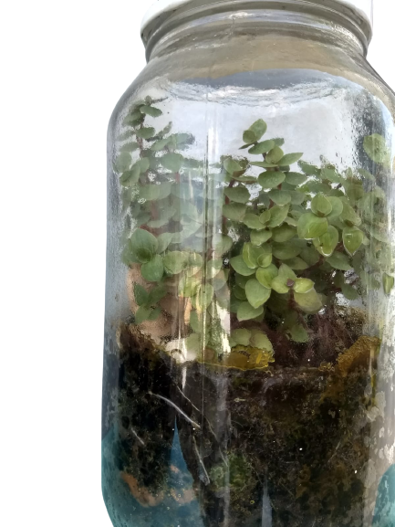
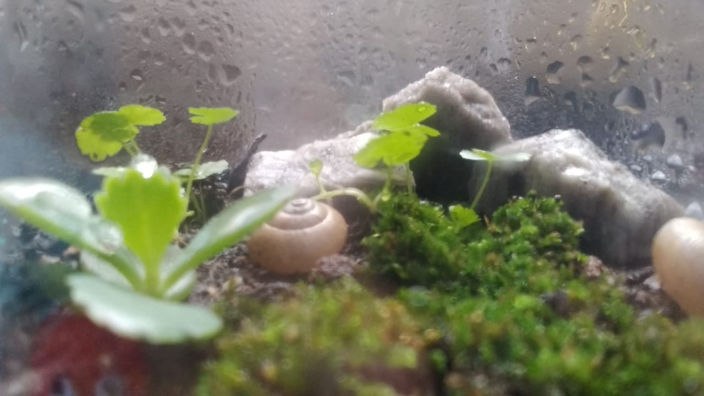
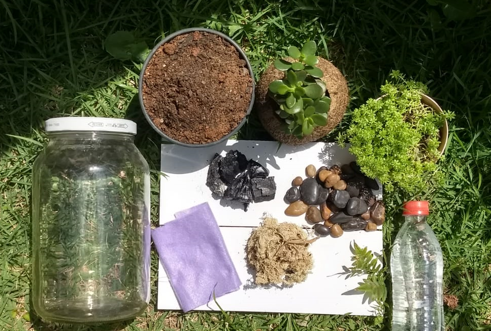
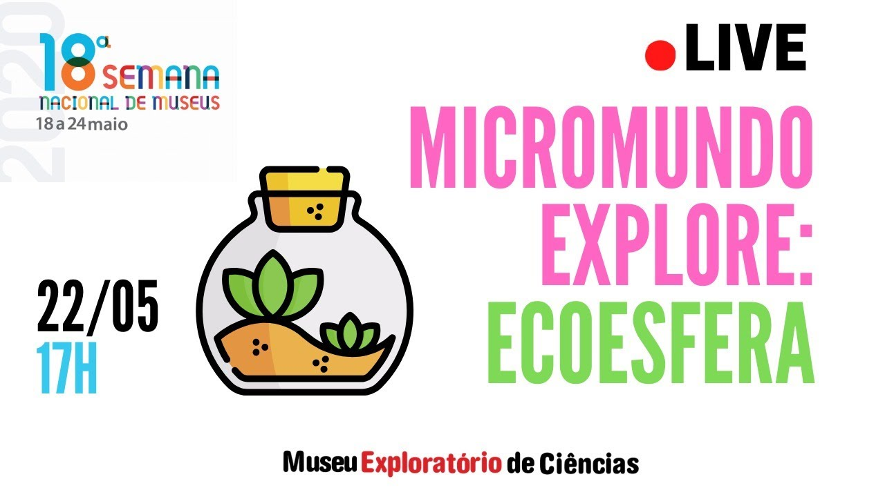

# Construindo uma EcoEsfera

|Construindo uma EcoEsfera||  
|:-------------:|:-------------:|
| Já imaginou ter um pedacinho da natureza em um pote pertinho de você? Ver um ecossistema se desenvolvendo e crescendo? Construa o seu micromundo, conhecendo o funcionamento básico de um ecossistema, os caminhos do ciclo da água e o processo de equilíbrio entre os vários elementos. Aventure-se construindo uma EcoEsfera, um universo incrivelmente bonito, vivo e autossuficiente.!.|   | 
 

## Faixa Etária

|Faixa etária indicada: à partir de 8 anos ||
|:-------------:|:-------------:|
|*(A equipe do Museu adora um desafio! Caso deseje agendar essa oficina para outra faixa etária, entre em contato que podemos trabalhar juntos em uma adequação de conteúdo.)*| |

## Material:
* Terra
* Pedrisco
* Carvão de Churrasco (pedaços pequenos)
* Plantas pequenas, ervas daninhas, suculentas ou musgos.
* Pote transparente de Vidro (Potes de Geleia, Azeitona e semelhantes) com tampa
* Pedaço pequeno de Pano, aprox. 10x10cm (Feltro/TNT/Manta Geotêxtil/Algodão/etc.)

## Materiais opcionais:
* Areia
* Pedras de Jardim
* Musgo seco (Esfagno)
* Casca de árvore (Geralmente casca de pinus, vendido também como substrato de orquídea)

## Montagem
|Para ter sua própria ecoesfera|| 
|:-------------:|:-------------:|
|Siga o passo a passo do vídeo. (_É só clicar na imagem ao lado que você será redirecionado_)||
