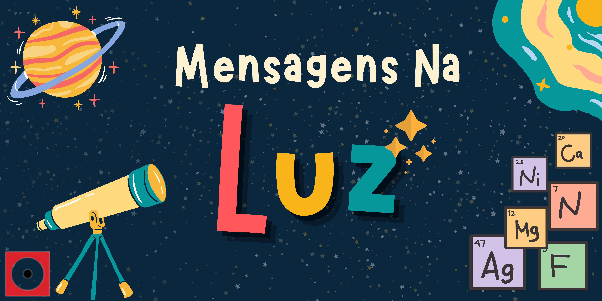

# Mensagens na Luz - Espectrômetro Caseiro

## Oficina PRESENCIAL disponível para agendamentos.

| |
| :-----:|
|Sabia que a luz pode revelar a composição de um astro celeste?  Descubra o que é um espectrômetro, e como ele funciona, construindo o seu modelo caseiro, e com o auxílio da Física, analise os espectros coloridos em busca de importantes informações escondidas.|

## Conceitos abordados e habilidades

Método científico, corpos celetes, elementos químicos, luz e cores, espectroscopia, experimentação.

## Materiais

* Caixa de sapatos
* Compact Disc (CD)
* Tesoura ou estilete
* Papel de seda
* Fita crepe ou adesiva
* Fonte luminosa (luz solar, lâmpada, lanterna, apontador laser, etc.)

## Como fazer:

| Se inscreva em nossas oficinas para acompanhar o passo a passo! |
| :-----:|
||

## Referências

Oficina baseadas em [Experimentos de Astronomia para o Ensino Fundamental e Médio](http://each.uspnet.usp.br/ortiz/classes/experimentos_2011.pdf) de Roberto Ortiz - Escola de Artes, Ciências e Humanidades da USP.

## Para mais informações entre em contato

* Por email: museu@unicamp.br
* Ou acesse o [Site Oficial do Museu](https://www.mc.unicamp.br/visite)

