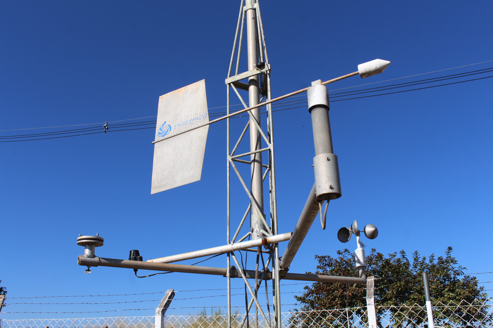
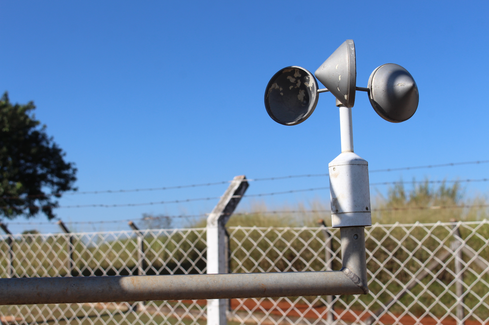
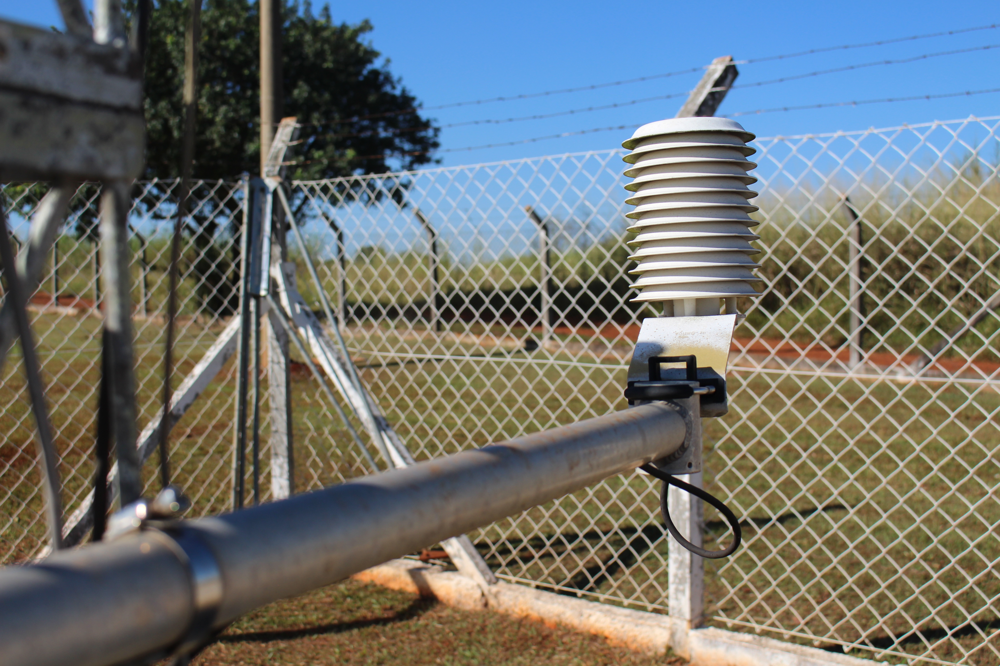

# Estação Meteorológica

## Oficina PRESENCIAL disponível para agendamento.

| |
|:-------------:|
| Você sabe o que é um barômetro? E uma biruta? Como será que é medida a quantidade de chuva? Na visita mediada à Estação Meteorológica do CEPAGRI que fica no Museu Exploratório de Ciências você vai conhecer sobre vários instrumentos que são utilizados para fazer estudos meteorológicos, previsões do tempo e muito mais!|
 

## Faixa Etária
Faixa etária indicada: a partir de 8 anos.

## Conceitos Abordados e Habilidades

Clima, tempo, grandezas meteorológicas e aparelhos de medição, impactos das variáveis atmosféricas na segurança e bem-estar humanos, e uso dos dados meteorológicos na previsão do tempo.

|||
|:-------------:|:-------------:|
|||

## Créditos
CEPAGRI - Centro de Pesquisas Meteorológicas e Climáticas Aplicadas à Agricultura (Unicamp)

## Para mais informações entre em contato

* Por email: museu@unicamp.br
* Ou acesse o [Site Oficial do Museu](https://www.mc.unicamp.br/visite)

  <a href="https://www.facebook.com/mcunicamp/">
     
  <a href="https://www.instagram.com/mcunicamp/">
     
  <a href="https://www.tiktok.com/@mcunicamp">
    
    
