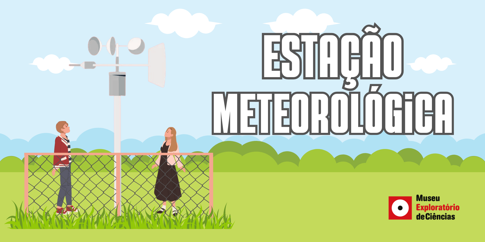

# Estação Meteorológica

## Oficina PRESENCIAL disponível para agendamento

| |
|:-------------:|
| Você sabe o que é um barômetro? E uma biruta? Como será que é medida a quantidade de chuva? Na visita mediada à Estação Meteorológica do CEPAGRI que fica no Museu Exploratório de Ciências você vai conhecer sobre vários instrumentos que são utilizados para fazer estudos meteorológicos, previsões do tempo e muito mais!|
 

## Faixa Etária
Faixa etária indicada: qualquer idade

## Conceitos Abordados e Habilidades

Clima, tempo, grandezas meteorológicas e aparelhos de medição.

## Referências

## Créditos
CEPAGRI - Centro de Pesquisas Meteorológicas e Climáticas Aplicadas à Agricultura (Unicamp)

## Para mais informações entre em contato

* Por email: museu@unicamp.br
* Ou acesse o [Site Oficial do Museu](https://www.mc.unicamp.br/visite)
