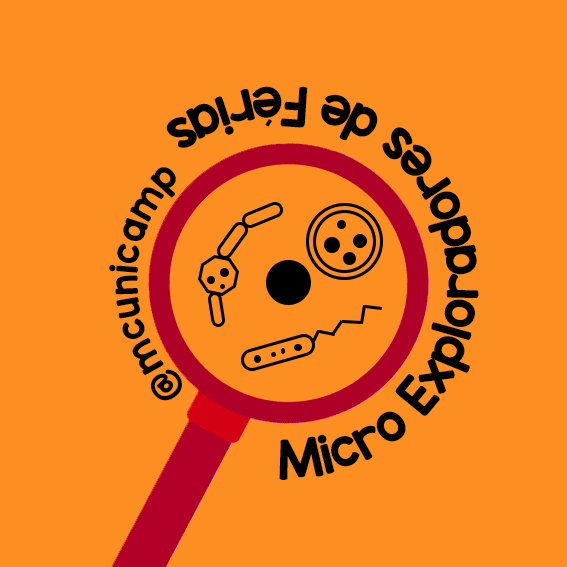

# Micro Exploradores de Férias

Grandes exploradores do mundo microscópico, estes são os materiais que utilizaremos ao longo do nosso programa de férias! Estão prontos para analisar o mundo microscópico?

## Antes de começar os Experimentos

Antes de começarmos nossa viagem pelo MicroMundo precisamos nos preparar! O primeiro passo é procurar em casa diferentes materiais que nos permitam ver o mundo microscópico melhor. Nossos olhos são excelentes, mas alguns organismos que queremos trabalhar são menores do que nossa capacidade de visão natural, procure por materiais de ampliação como lupas, lentes, câmeras de celular do tipo _macro_. O museu pode te ajudar nesta tarefa, assista nosso vídeo onde ensinamos como fazer um [Microscópio Caseiro](https://www.youtube.com/watch?v=XHJcYAa0a94) utilizando um dispenser de álcool em gel e papelão. Ou então nosso vídeo [Microscópio Caseiro 2.0]() que utiliza a lente de um leitor de CD para dar um upgrade em nossa capacidade de ampliação.

## Meio de Cultura

Nossa primeira visita no MicroMundos será no reino das Bactérias e dos Fungos, para estudar esses carinhas tão importantes, teremos que fazer um **Meio de Cultura**.

### Materiais

* 2 Pacotes de 12g de Gelatina Incolor (qualquer marca, pode ser da mais barata)
  * Esse ítem pode ser substituído por 2 caixinhas de Gelatina Sabor Abacaxi (sim, o sabor é importante.)
* 2 Cubinhos de Caldo de Carne
* 2 Colheres de \[sopa] de Açúcar
* Água
* Potes de plástico (Preferencialmente transparente e descartáveis. Ex.: Copos descartáveis; Potes de Margarina; Potes de Doce; Etc)
* Cotonete

## Fazenda de Musgos

Nossa segunda parada, estamos interessados em habitantes um pouco maiores do mundo micro. Para conseguirmos explorar essa outra escala da vida construíremos uma fazenda diferente: com musgos no lugar de outras plantas e animais que serão bem menores do que uma vaca, será o ambiente perfeito para observarmos.

### Materiais

No item com mais de uma opção separada por _ou_ você não precisa de **todos** os materiais citados, no mínimo 1 deles.

* Casca de Pinus _ou_ Substrato de Orquídea  _ou_ Musgo Seco (Esfagno) _ou_ Argila Expandida  _ou_ Carvão de Churrasco (quebrado em pequenos pedaços) _ou_ Carvão Ativado em Pellets 
  * Não utilizaremos grandes quantidades desse material, em média 2 xícaras é o suficiente.
* Um pote de plástico transparente com tampa
* Musgos vivos (Na oficina daremos dicas de onde encontrá-los)

## Lista de Materiais 

Para que você não se esqueça de nada, preparamos uma lista de compras que você pode imprimir e utilizar enquanto procura ou compra os materiais necessários! Lembrando sempre de tomar todas as [medidas de precaução](https://www.who.int/pt/emergencies/diseases/novel-coronavirus-2019/advice-for-public) quando estiver fora de casa. 

[Clique aqui](./lista.pdf)
