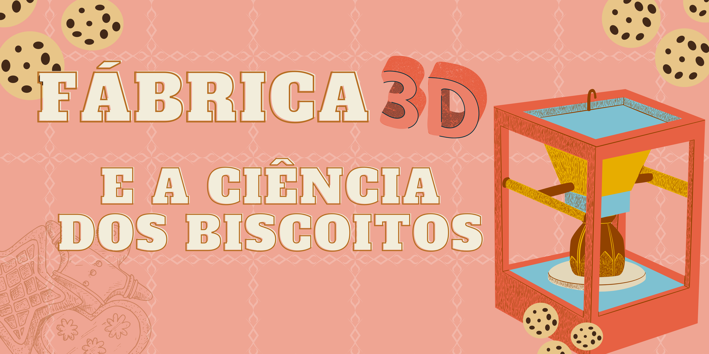

# Fabrica 3D e a ciência dos biscoitos

## Disponível para agendamento de oficinas PRESENCIAIS

|  |
| :-----:|
|Essa oficina aborda a tecnologia de impressão 3d e os segredos da       ciência por trás da confecção de biscoitos, além de comer os            biscoitos, os participantes podem levar a forma impressa para casa.|

## Faixa Etária

Faixa etária indicada: de 8 à 15 anos

| ||
|:------:|:------:|
|||
|||

## Conceitos abordados e Habilidades
Átomos, moléculas, formação do glúten e impressão 3d.

## Materiais e Ingredientes
* Bacia
* Filme de pvc
* Papel manteiga
* Forminhas
* Bandejas
* Farinha de trigo 
* Manteiga ou margarina ou Óleo
* Açúcar
* Água

## Para mais informações entre em contato

* Por email museu@unicamp.br

* Ou acesse o [Site oficial do Museu](https://www.mc.unicamp.br/visite)
