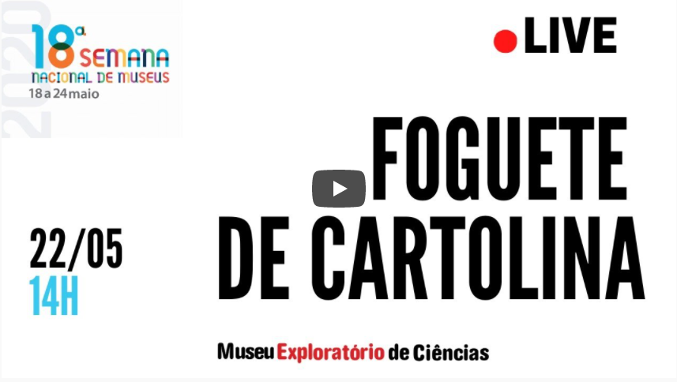
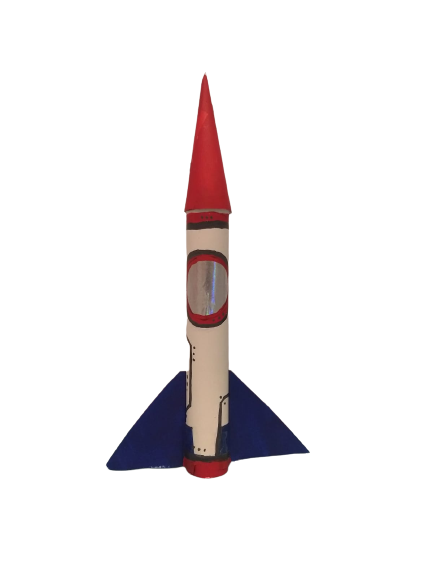

# Foguetes de Cartolina

|Apresentação|
|:-------------:|
|Nessa oficina o céu não é mais o limite! Venha construir um foguete que, embora seja simples, é muito poderoso e pode ir longe. Conheça conceitos básicos de Física usados na construção de foguetes, explore métodos de comparação de distâncias e técnicas de aperfeiçoamento de voo, aprimore o seu projeto com escolhas bem fundamentadas. Coloque a mão na massa para entender, na prática, como pensam e agem os cientistas, diante dos desafios.|| 
||

## Faixa Etária
Faixa etária indicada: 10 a 15 anos

*(A equipe do Museu adora um desafio! Caso deseje agendar essa oficina para outra faixa etária, entre em contato que podemos trabalhar juntos em uma adequação de conteúdo.)*

## Materiais
* Tesoura
* Garrafa Pet vazia (de 1,5 litros ou 2 litros)
* Pedaço de papel alumínio (30cm x 30cm)
* Fita Crepe ou Fita Durex
* Cartolina ou Folha de Sulfite A4
* Molde impresso em folha A4

## Molde
Imprima o molde abaixo em uma folha A4 na orientação retrato antes da oficina para construir as peças necessárias.         
_(Clique com o botão direto do mouse em cima da imagem, depois "Salvar imagem como" para salvar o arquivo e conseguir imprimir a imagem sem distorção)_

## Instruções de montagem

|(Clique na imagem para ser redirecionado ao vídeo)||
|:-------------:|:-------------:|
|||

Continue ligado em nossas redes sociais para se inscrever na oficina onde aprederemos a construir esse foguete incrível! 
