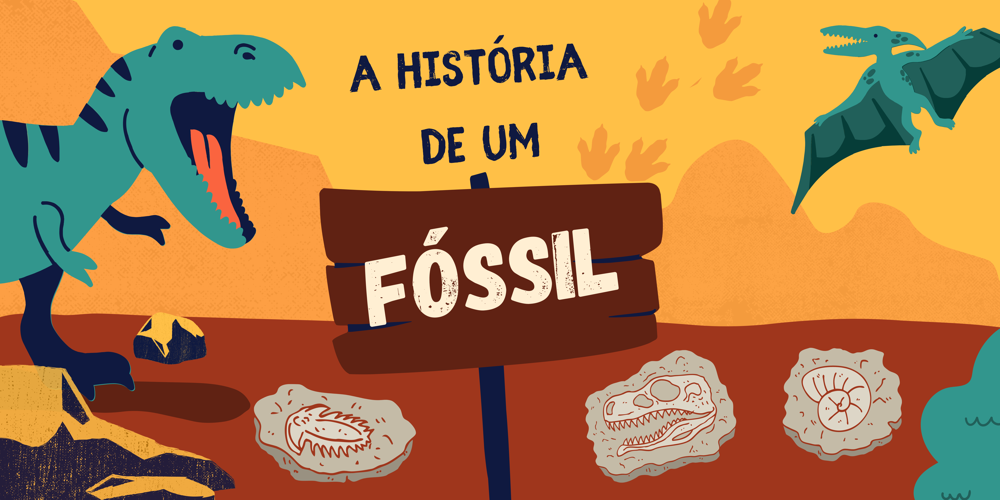
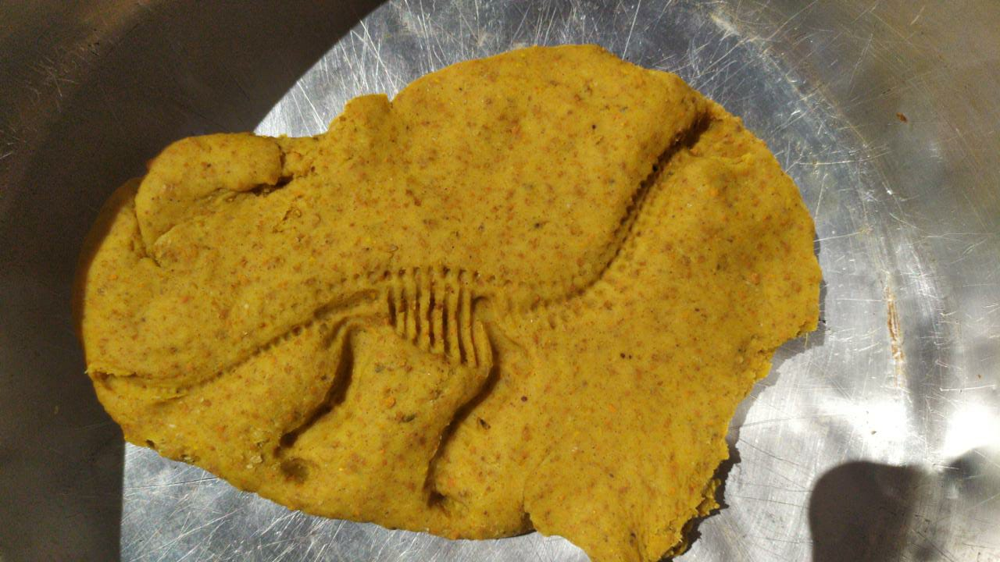
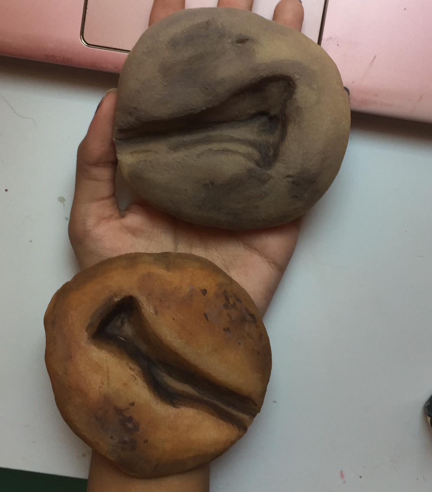

# A História de um Fóssil: Colocando a Mão na Massa

## Oficina PRESENCIAL disponível para agendamentos

| |
|:-------------:|
|Nessa oficina, recriaremos, juntos, uma representação das condições de fossilização e produziremos o nosso “fóssil” caseiro, ao estilo fóssil de impressão. Faremos isso colocando a mão na massa, preparando uma mistura de ingredientes simples para obter uma réplica de rocha sedimentar, base do nosso projeto.|

## Faixa Etária

|Faixa etária indicada: 7 a 12 anos||
|:-----:|:-----:|
|*(A equipe do Museu adora um desafio! Caso deseje agendar essa oficina para outra faixa etária, entre em contato que podemos trabalhar juntos em uma adequação de conteúdo.)*||

## Conceitos abordados e Habilidades
Método científico, paleontologia, fósseis, fossilização, experimentação.

## Ingredientes e medidas 

|Ingrediente| **Para um montão:** | **Para um montinho:**  |
|:-----------:|:-------------:|:-------------:|
|Farinha de trigo| 2 xícaras|  1/2 xícaras |
|Sal| 1 xícara| 1/4 xícara|
|Água morna | 1 xícara  | 1/4 xícara|

* **Objetos pequenos para “fossilizar”**  (modelos miniaturas de dinossauros e outros animais, folhas de plantas, conchas, etc).

## Como fazer
* Misture bem a farinha e o sal
* Adicione a água morna aos poucos 
* Mexa até formar uma massa homogênea, quando ela deixar de grudar na sua mão estará pronta.
* Agora é só carimbar o objeto que deseja fossilizar.
* Deixe a massa secando
  * Você pode deixar ao ar livre por aproximadamente duas semanas.
  * Ou acelerar um pouco deixando no forno em temperatura baixa entre 15 a 30 minutos.
  
## Dicas

|||
|:-----------:|:-------------:|
|Depois de seco, é interessante impermeabilizar seu fóssil. Você pode fazer isso passando uma camada de cola branca ou verniz sobre o fóssil. Ou então pintar com tinta guache, deixando ele com cara de rocha!| |

## Para mais informações entre em contato

* Por email museu@unicamp.br

* Ou acesse o [Site oficial do Museu](https://www.mc.unicamp.br/visite)

  <a href="https://www.facebook.com/mcunicamp/">
     
  <a href="https://www.instagram.com/mcunicamp/">
     
  <a href="https://www.tiktok.com/@mcunicamp">
    
