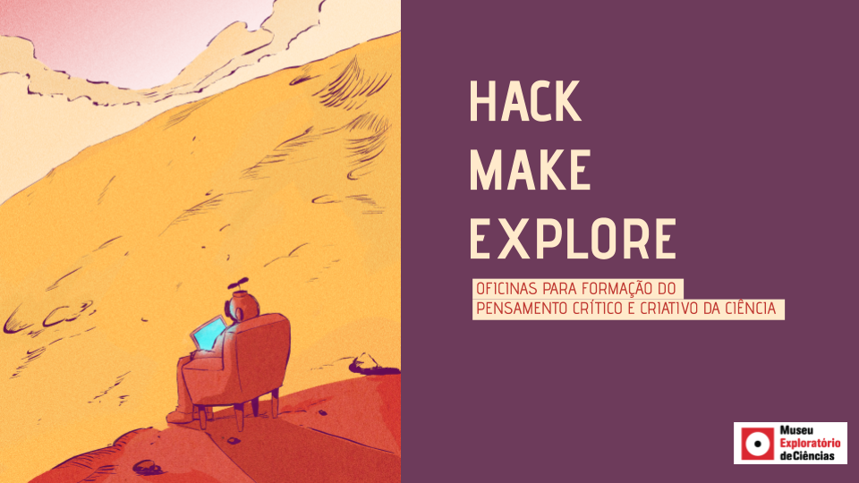

Numa era na qual o acesso a um imenso fluxo de informações é facilitado por novas tecnologias e novos modos de interação social, como promover a construção do conhecimento autônomo e crítico?

Tem sido crescente o relato de projetos com crianças e jovens ao redor do mundo que promovem uma postura crítica, ativa e criativa na condução de projetos, que envolvem construção de artefatos e exploração de fenômenos do mundo. Por trás de culturas e movimentos como o Hacker e o Maker está um princípio poderoso de que a criança e o jovem podem se apropriar de artefatos físicos e digitais, investigá-los e dar-lhes novos propósitos, ou fabricar seus próprios artefatos.

Indo um passo adiante, Museu Exploratório de Ciência da Unicamp tem investigado, desde 2016, como aliar aspectos da cultura hacker e do movimento maker à divulgação e formação em Ciência. Isso tem se configurado em uma metodologia batizada de Hack/Make/Explore.

Vários princípios presentes em hacker/maker também são encontrados na literacia científica. Do inglês scientific literacy, literacia científica expressa uma habilidade de pensamento crítico e autônomo sobre ciência, suas descobertas e resultados. Isto inclui a capacidade de interpretar fatos e dados, de entender o processo científico, suas características, qualidades e limitações. Também expressa a capacidade de perceber como a ciência e o conhecimento científico podem nos ajudar a saber mais sobre o mundo e a tomar decisões do dia a dia. Alguns autores também traduzem como alfabetização científica.

O Museu tem trabalhado em uma revisão de sua estratégia para apresentar ciência à comunidade, principalmente por sua vocação exploratória, partindo de sua tradição em oficinas e exposições com este caráter. A questão é o quanto de ciência tem sido tratado nas exposições/oficinas, bem como se o seu enfoque valoriza o processo e a literacia científica, além dos resultados da ciência. Nesse sentido, o Museu tem feito estudos sobre iniciativas hacker/maker e sua aplicação na divulgação científica e tem experimentado a criação de oficinas que aliam a cultura hacker/maker e a literacia científica.

# Ferramentas para Começar

A seguir está apresentado um conjunto de ferramentas que usamos no ciclo Hack | Make | Explore para a concepção e acompanhamento das oficinas.

[Elaborando um Plano de Oficina](https://docs.google.com/document/d/13kqo0iyEiLdfZHtpcL54CBCUF7mzctqtND1O4dFNUvs/edit?usp=sharing) - roteiro para o planejamento e acompanhamento de oficinas.

[Plano da Oficina de Aviões de Papel](https://docs.google.com/document/d/1Dl-i43uWx55hUe4-dyF2G8emZFqEyXSiq84cVSfYHmY/edit?usp=sharing) - plano de oficina feito de forma colaborativa no curso de extensão Hack-Make-explore.

[Plano da Oficina do Herbário](https://docs.google.com/document/d/1_K3UdQZSE5O_ZKUwV2FhZbwoyZ4oxPAT6JQXRpNKFgg/edit?usp=sharing) - plano de oficina concebido pelo Herbário do Instituto de Biologia e aplicado no Museu.

[Plano da Oficina A Grande Descoberta de um Fóssil](https://docs.google.com/document/d/1m9NMxivEHiUoXNWqvxDZv0oBeJd4xp115cnAKjtXfCY/edit?usp=sharing) - plano da oficina A Grande Descoberta de um Fóssil desenvolvida em conjunto com o Instituto de Geociênias.

[Canvas de Aprendizagem e Ciência](https://docs.google.com/document/d/1zYZZ_ZquPJ5Odk3z5WNF_q3UHIElWKse7Xtb7g-bJk8/edit?usp=sharing) - guia para o uso de Canvas de Aprendizagem e Ciência (mais atualizado em relação ao disponibilizado no roteiro de planejamento)  e exemplos de canvas sobre: Foguetes e Herbário.