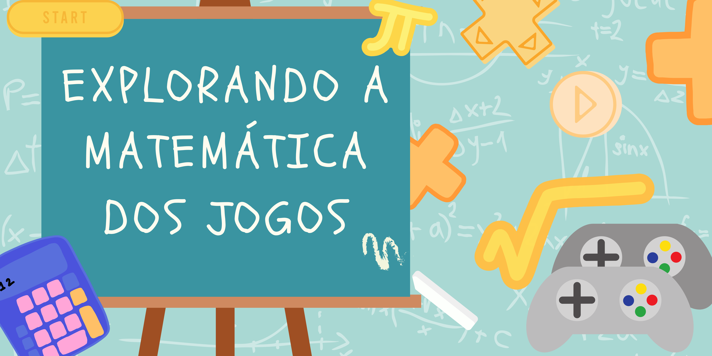

## Explorando a Matemática dos Jogos

|  |
|:-----:|
|O ponto de partida é o simples jogar: resolver o problema, completar o trajeto, vencer o colega (ou o computador). O ponto de chegada é entender a matemática do jogo, buscar estratégias que garantam sucesso ou vitória, sempre!|
|Cada jogo tem um aplicativo que pode ser explorado online e os desafios matemáticos do problema são variados, podendo ser tão grandes quanto desejarem (variando o número de peças, tamanho do tabuleiro, quantidade de jogadores, etc).|

