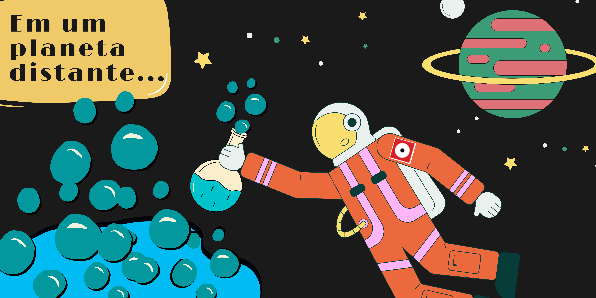
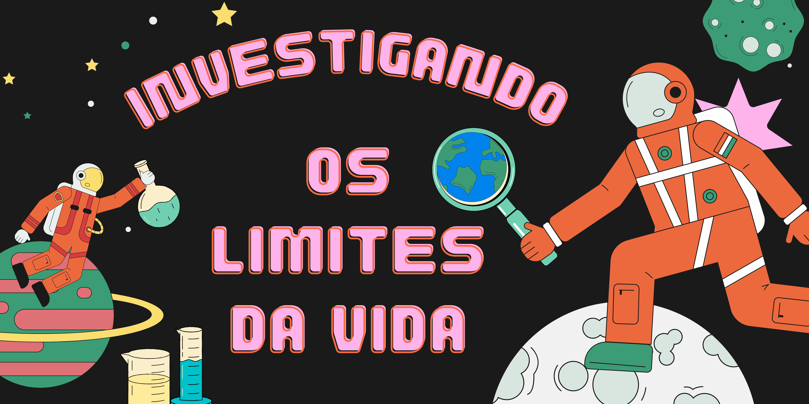

#  Investigando os Limites da Vida 

## Oficina PRESENCIAL disponível para agendamentos

## Como as Mudanças Climáticas afetam os seres vivos

|Um dos astronautas da equipe do Museu Exploratório de Ciências da Unicamp precisa de ajuda! Durante uma missão em um planeta distante ele encontrou estranhos lagos borbulhantes. Participe dessa incrível oficina e ajude na missão!|
| :------:|
||

## Apresentação

||
| :------:|
|Através do contato com nosso astronauta perdido os participantes dessa oficina experimentaram a rotina de um cientista. Com materiais simples realizaremos experimentos e coleta de dados para auxiliar o nosso colega perdido no espaço. Além disso, seremos capazes de compreender como os impactos ambientais alteram as condições de vida dos seres vivos e como a manutenção da vida na Terra se trata de um equilíbrio delicado.|

## Faixa Etária
Faixa etária indicada: 8 a 11 anos

(A equipe do Museu adora um desafio! Caso deseje agendar essa oficina para outra faixa etária, entre em contato que podemos trabalhar juntos em uma adequação de conteúdo.)

## Conceitos abordados e Habilidades
Método científico, mudanças climáticas, fenômenos ambientais, condições necessárias para a vida.

## Materiais
### Ingredientes

| Ingrediente | Quantidade  |
|:-----------:|:-------------:|
|Fermento biológico seco| 3 Pacotes de 10g|
|Água morna | 300 mL|
|Água gelada | 100 mL |
|Gelo| 2 Cubos|
|Vinagre | 2 Colheres de sopa|
|Açúcar branco | 4 Colheres de sopa|

### Instrumentos

- 4 Frascos/Recipientes iguais 
  - Exemplos: copos idênticos, vidros de azeitonas, potes de geleia, etc. 
- Filme de pvc (plástico de cozinha);
- Fita crepe ou durex;
- Colher de sopa;
- Colher de café;
- Copo de Medidas;
- Régua;

## Autoras
Essa oficina foi idealizada e desenvolvida por alunas de graduação durante uma disciplina de estágio de licenciatura no Museu.

**[Cecília Damiano](http://lattes.cnpq.br/5058348826136179)** 
[✉️](mailto:c195629@dac.unicamp.br)

**[Gabriel Bariani](https://www.linkedin.com/in/gabriel-ant%C3%B4nio-de-oliveira-bariani/)** 
[✉️](mailto:gabrielbariani@gmail.com)

**[Juliana Di Beo](https://www.linkedin.com/in/julianadibeo/)** 
[✉️](mailto:j200398@dac.unicamp.br)

**[Paloma Messias](http://lattes.cnpq.br/0485200457965458)** 
[✉️](mailto:p204297@dac.unicamp.br)

## Para mais informações entre em contato

* Por email: museu@unicamp.br
* Ou acesse o [Site Oficial do Museu](https://www.mc.unicamp.br/visite)
