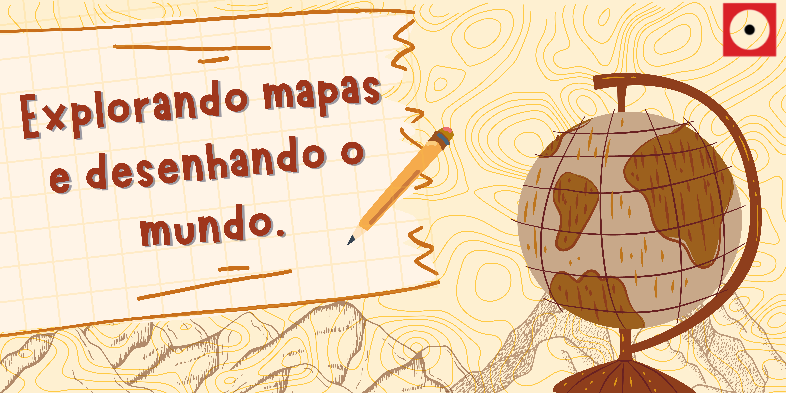

# Explorando mapas e desenhando o mundo.

| |
|:-------------:|
|Construa montanhas, e aprenda a utilizar diferentes técnicas de representação para desenhar o mundo. Acompanhe a evolução do mapeamento topográfico e explore mapas históricos.|

## Faixa etária

|Faixa etária: 9 a 12 anos||
|:------:|:------:|
|(A equipe do Museu adora um desafio! Caso deseje agendar essa oficina para outra faixa etária, entre em contato que podemos trabalhar juntos em uma adequação de conteúdo.)|          |

## Conceitos abordados e Habilidades
Método científico, mapas, topografia, experimentação, habilidades manuais e abstração.

## Materiais 

| Materiais: | | | 
|:-----------:|:-------------:|:-------------:|
||  Lápis grafite |Lápis de cor|
| | Papel sulfite  | 1 pedaço de fio (linha de costura ou fio dental) |
|  |  1 régua |Massa de modelar ou argila |

|||
|:------:|:------:|
|**OBS:** A massa de modelar não pode ser muito pegajosa. A quantidade deve ser igual ao tamanho de seu punho.   | .gif)|

## Para mais informações entre em contato

* Por email: museu@unicamp.br
* Ou acesse o [Site Oficial do Museu](https://www.mc.unicamp.br/visite)
