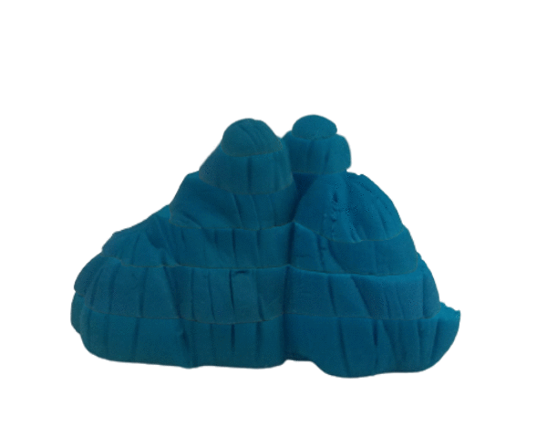
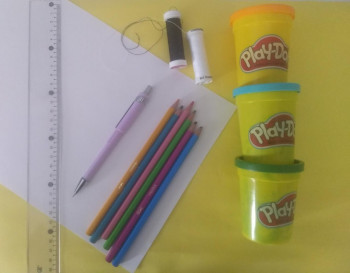

# Explorando mapas e desenhando o mundo.
### Construindo Mapas Topográficos

|  |   |
|:-------------:|:-------------:|
|Construa montanhas, e aprenda a utilizar diferentes técnicas de representação para desenhar o mundo. Acompanhe a evolução do mapeamento topográfico e explore mapas históricos.|                |
|  |   |

## Faixa etária
Faixa etária: 9 a 12 anos
 
(A equipe do Museu adora um desafio! Caso deseje agendar essa oficina para outra faixa etária,     
entre em contato que podemos trabalhar juntos em uma adequação de conteúdo.)
 
## Materiais 

|  | | | 
|:-----------:|:-------------:|:-------------:|
|**Materiais:**|  Lápis grafite |Lápis de cor|
| | Papel sulfite  | 1 pedaço de fio (linha de costura ou fio dental) |
|  |  1 régua |Massa de modelar ou argila |

**OBS:** A massa de modelar não pode ser muito pegajosa. A quantidade deve ser igual ao tamanho de seu punho.

.gif)
