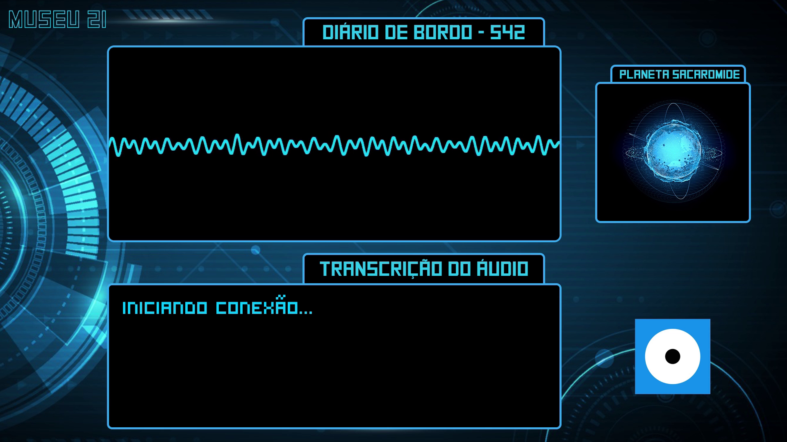

# Registro das Mensagens Recebidas na Central de Lançamento de Foguetes do Museu

O Museu acabou de enviar um astronauta para um exoplaneta à procura de vida, o Planeta Sacaromide. Após a longa viagem pelo universo a bordo da nave *Exploratória 2000*, nosso cientista encontrou um planeta parecido com Marte em sua coloração, mas com diversos lagos borbulhantes em sua superfície!

Não se tratavam de fontes termais, mas sim de lagos cheios de vida microscópica, segundo as leituras do nosso cientista em Sacaromide, a água dos lagos apresentam diferentes composições e características, indo desde lagos bastante ativos até lagos em que não há bolhas. Ele nos enviou um relatório em áudio, porém, devido a grande distância do planeta eles chegaram corrompidos. 

Clique na imagem abaixo para acessar a mensagem, preste bastante atenção e se prepare para ajudar o nosso astronauta na oficina!

