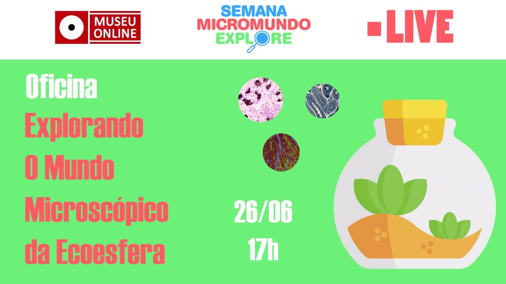
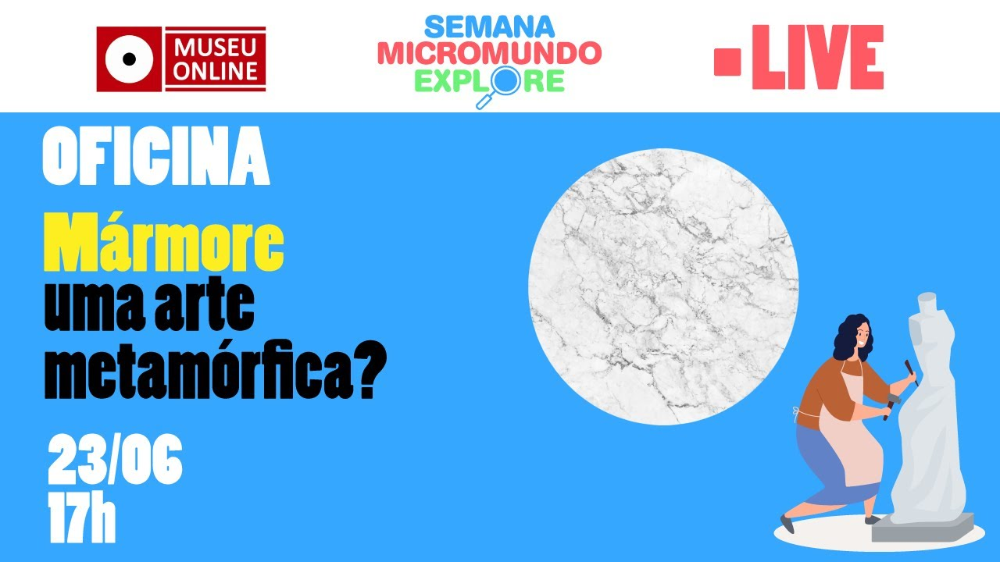
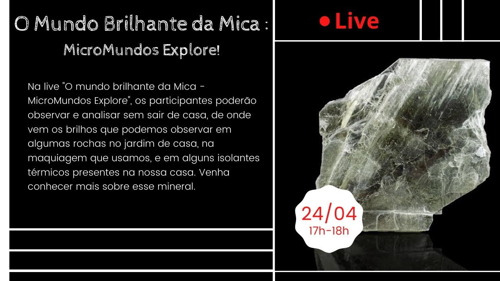
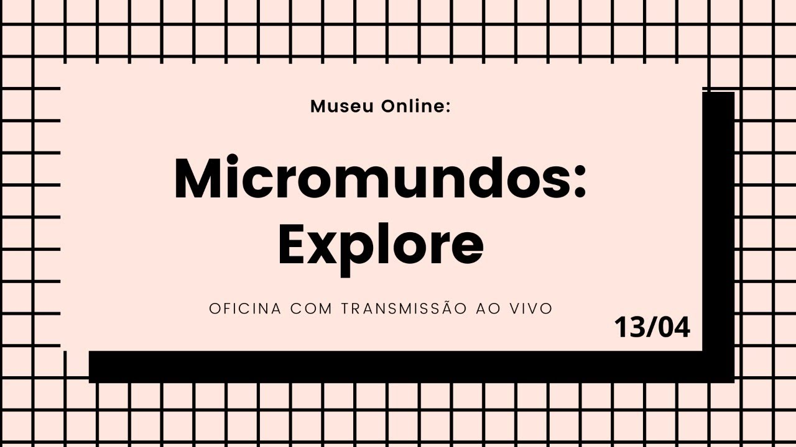
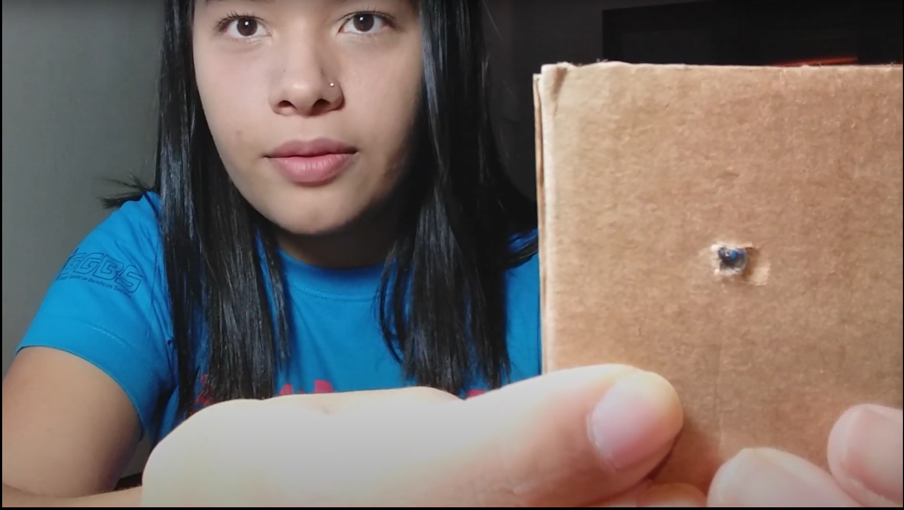
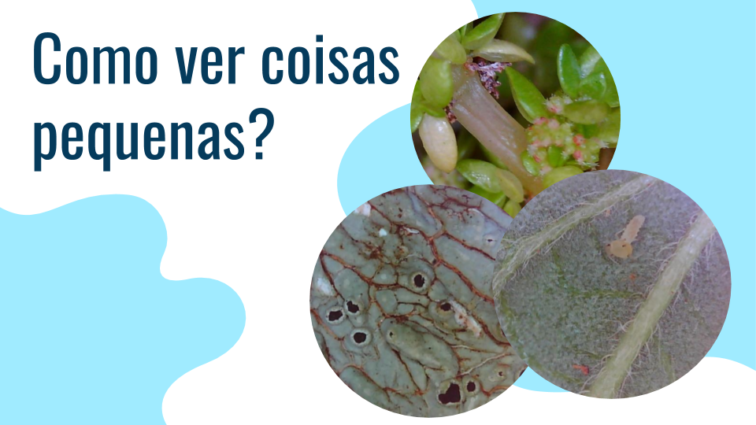

# Micromundos
Um mundo incrível se esconde além da capacidade de ampliação de nossos olhos. Criaturas, minerais e vegetais esperando para serem descobertos nesse universo diminuto. Embarque conosco na exploração desses micromundos!

_Abaixo temos uma série de vídeos e lives, ao clicar nas imagens você será redirecionado para o vídeo em nosso canal do youtube!_

# Micromundo Animal

## EcoEsfera

## Explorando o Mundo Microscópico da Ecoesfera

## O que se esconde na água parada?

# Micromundo Mineral

## Mármore - Uma arte metafórica

## Granada - Uma Explosão de Curiosidade

## O Mundo Brilhante da Mica

## Micromundos Explore: Formação de Solo

# Como observar o mundo microscópico

## Microscópio Caseiro

## Maneiras de explorar os micromundos

