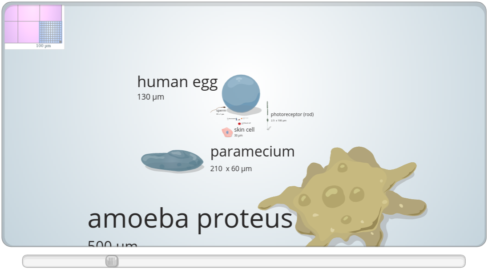
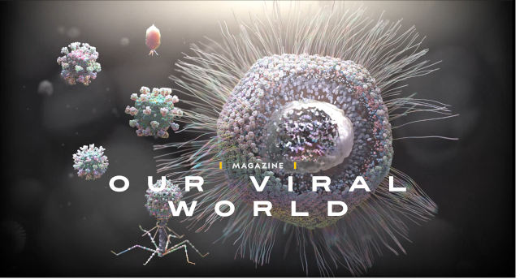

# Micromundos - Seleção de Material

## Cell Size and Scale

Simulação de um ampliador que vai da escala de um grão de café até um átomo de carbono.

## Our Viral World

Excelente conjunto de ilustrações apresentando os diferentes tipos de vírus, suas estruturas e escalas.

