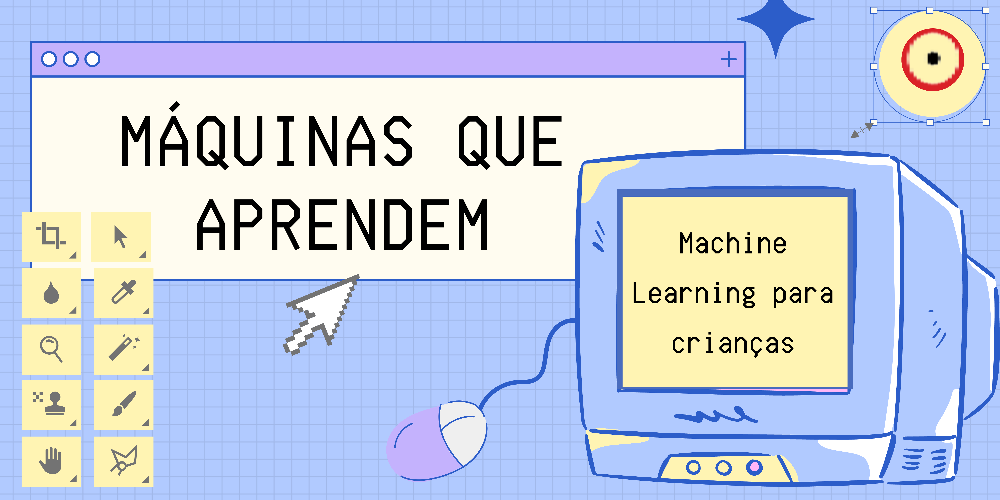

# Máquinas Inteligentes que Aprendem - Desvendando a Inteligência Artificial

## Introdução

| |
| :------:|
|Na oficina, obtenha noções de como um computador é preparado usando conceitos de Aprendizado de Máquina (Machine Learning).  Aprimore o projeto proposto, realizando testes de avaliação e ajustando os parâmetros da programação.|

## Faixa Etária

Faixa etária indicada:

* Júnior: 7 a 11 anos.

* Avançado: à partir de 12 anos.
