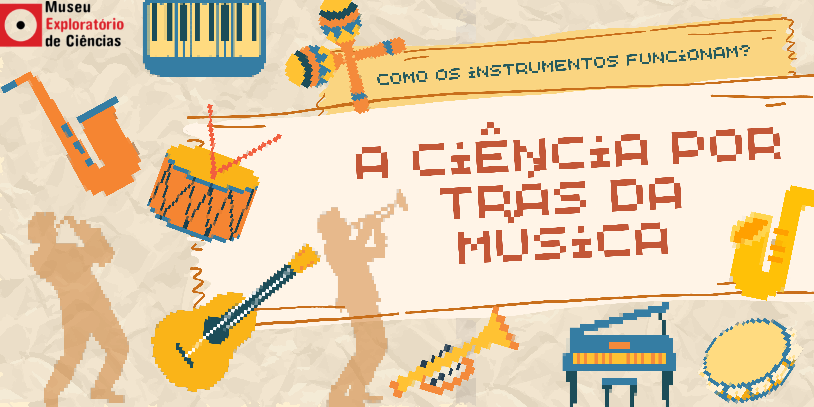

# Como os Instrumentos Funcionam? - A Ciência por Trás da Música

|Apresentação|
|:-------------:|
|Som, música e conceitos de Física. Nesta oficina, veremos como as propriedades do som e os fenômenos que as alteram são usados na construção de instrumentos musicais. Aprenda a ler partitura da ciência e a produzir música em casa.|
||
|Após a apresentação, serão usados recipientes de vidro (copo, garrafas, taças) que serão preenchidos com quantidades diferentes de água. Então, com a colher, bateremos nos recipientes para ver as diferenças entre as frequências de cada um deles.|

## Faixa Etária
Indicada para o público de 8 a 10 anos

*(A equipe do Museu adora um desafio! Caso deseje agendar essa oficina para outra faixa etária, entre em contato que podemos trabalhar juntos em uma adequação de conteúdo.)*

## Conceitos abordados e habilidades
Método científico, ondas sonoras, frequência e amplitude de onda, altura e intensidade do som, experimentação.

## Materiais
|Materiais||  
|:-------------:|:-------------:|
|Recipientes de vidro vazios; Colher; Água| |
||-----> (Copos, garrafas de refrigerante, potes de azeitona, etc)|

*(IMPORTANTE: Acompanhe a oficina pelo computador ou notebook, tablet e celular apresentam dificuldade técnica)*

## Para mais informações entre em contato
* Por email: museu@unicamp.br
* Ou acesse o [Site Oficial do Museu](https://www.mc.unicamp.br/visite)

  <a href="https://www.facebook.com/mcunicamp/">
     
  <a href="https://www.instagram.com/mcunicamp/">
     
  <a href="https://www.tiktok.com/@mcunicamp">
    
