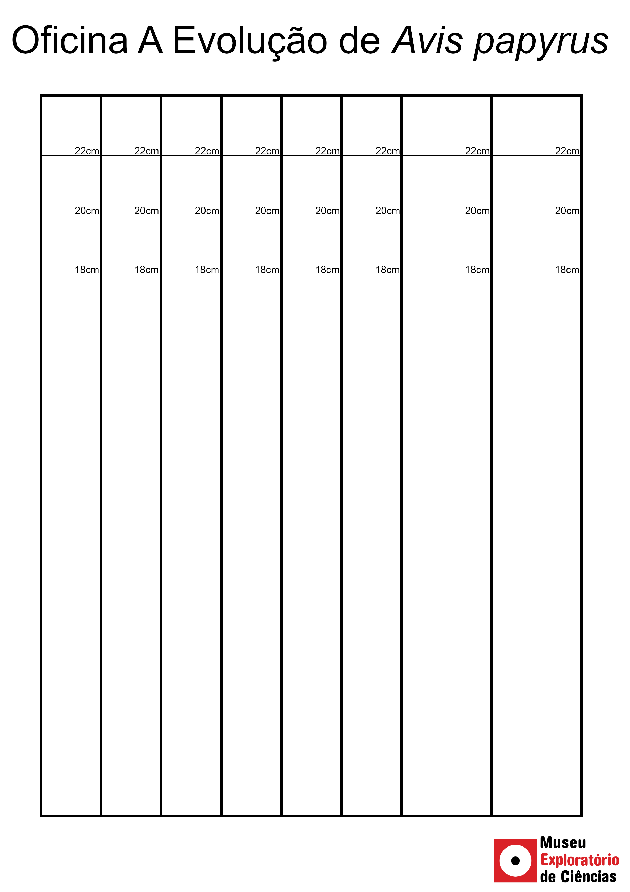

# A Evolução de _Avis papyrus_

## Apresentação
Que tal presenciar a beleza da evolução da vida diantes dos seus olhos? Com essa oficina você verá como mutações aleatórias e a seleção natural são capazes de moldar espécies!

## Materiais
* Canudos de papel (ou de plástico, caso você ainda os tenha guardado)
* Dado de 6 lados
* Fita crepe/durex
* Papel sulfite
* Tesoura
* Molde impresso

## Molde
Imprima o molde abaixo em uma folha A4 na orientação retrato antes da oficina para construir as peças necessárias.
_(Clique com o botão direto do mouse em cima da imagem, depois "Salvar imagem como" para salvar o arquivo e conseguir imprimir a imagem sem distorção)_

## Processo
Continue ligado em nossas redes sociais para se inscrever na oficina onde você aprenderá como a evolução funciona.

_Em breve disponibilizaremos o passo a passo aqui também_ ;)
