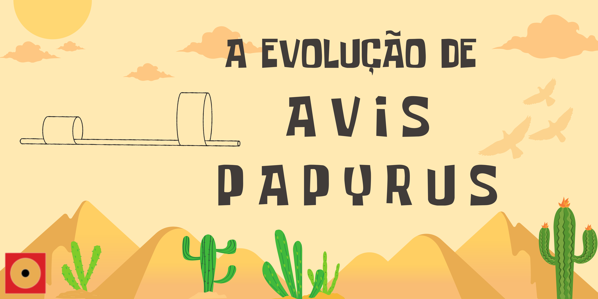
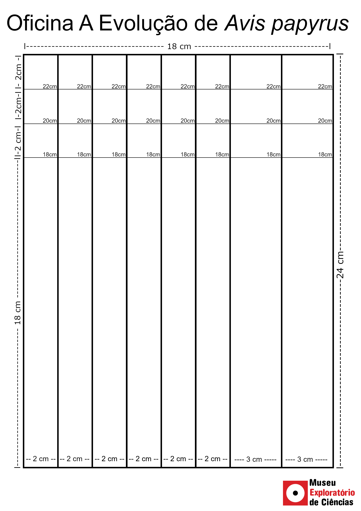

# A Evolução de _Avis papyrus_

## Oficina PRESENCIAL disponível para agendamento

Se prepare para ver a evolução atuando na prática e descobrir um dos mais importantes mecanismos da vida!

| |
| :-----:|
|Evolução é sinônimo de melhoria? Vamos descobrir juntos, criando a nossa própria espécie de ave e explorando os diversos caminhos do processo evolutivo. Qual será o comportamento de sua ave ao ser exposta aos desafios da seleção natural?|

## Faixa Etária
* Faixa etária indicada: a partir de 11 anos

(A equipe do Museu adora um desafio! Caso deseje agendar essa oficina para outra faixa etária, entre em contato que podemos trabalhar juntos em uma adequação de conteúdo.)

## Conceitos abordados e Habilidades
Evolução, mutações, seleção natural e diferenciação populacional.

## Materiais
* Canudos de papel (ou de plástico, caso você ainda os tenha guardado)
* Dado de 6 lados
* Fita crepe/durex
* Papel sulfite
* Tesoura
* Molde impresso

## Molde
Imprima o molde abaixo em uma folha A4 na orientação retrato antes da oficina para construir as peças necessárias. _(Clique com o botão direto do mouse em cima da imagem, depois "Salvar imagem como" para salvar o arquivo e conseguir imprimir a imagem sem distorção)_

## Processo
Continue ligado em nossas redes sociais para se inscrever na oficina onde você aprenderá como a evolução funciona.

_Em breve disponibilizaremos o passo a passo aqui também_ ;)

## Referências
A oficina do Museu Exploratório de Ciências se baseou nos seguintes trabalhos:

Roteiro original: Karin Westerling, Matthew Gage Middle School , Riverside, CA

Adaptado por: Vera Nisaka Solferini; Sónia Cristina de Andrade

## Para mais informações entre em contato

* Por email: museu@unicamp.br
* Ou acesse o [Site Oficial do Museu](https://www.mc.unicamp.br/visite)

