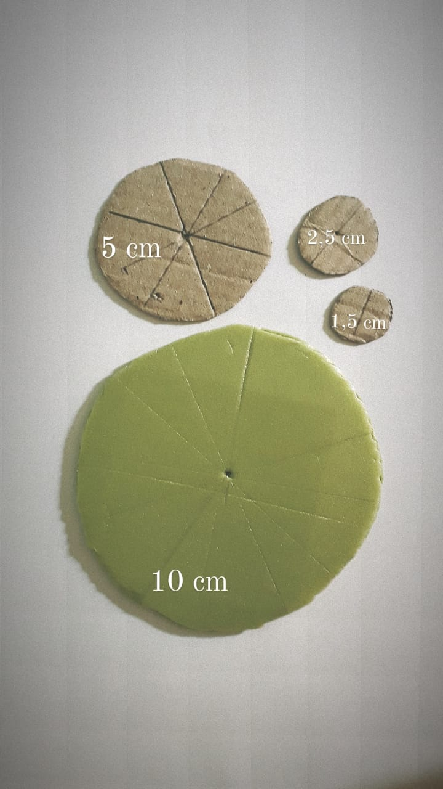

# Planet Hunters

 
#### “Você já pensou em viajar para um planeta com dois sóis? E um onde a vegetação é vermelha? Que tal visitar um planeta com um oceano de lava fervente?

## Apresentação
O Universo está repleto de planetas muito interessantes! Alguns são assustadores e outros têm características que vão muito além do que podemos imaginar! 
Em nossa Galáxia já foram descobertos alguns milhares desses planetas, mas ainda há muito o que se explorar! Em “Planet Hunters” vamos aprender como encontrar esses mundos tão distantes! Preparados para a caçada!?”

## Faixa Etária
Faixa etária indicada: 8 a 12 anos

(A equipe do Museu adora um desafio! Caso deseje agendar essa oficina para outra faixa etária, entre em contato que podemos trabalhar juntos em uma adequação de conteúdo.)

## Lista de materiais:

* Bandejinhas rasas de isopor (como as de supermercado) cortadas em círculos de quatro diâmetros diferentes (1.5 cm, 2.5 cm, 5.0 cm e 10.0 cm). Vide imagem abaixo.
* Duas folhas sulfite quadriculada (dimensões dos quadrados: 2cm x 2cm)
* Uma folha sulfite com gráficos
* Uma superfície para apoiar as folhas (tipo prancheta)
* Tinta guache de cor escura (de preferência preta, mas pode ser marrom ou verde escuro)
* Pincel pequeno (para passar a tinta no isopor)
* Lápis ou caneta
* Régua

