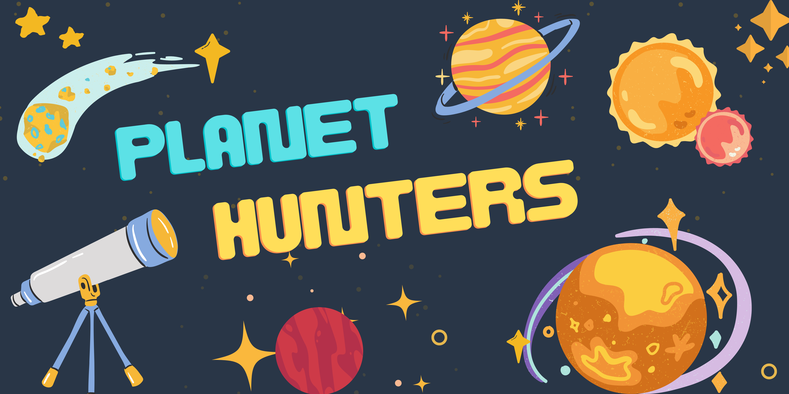
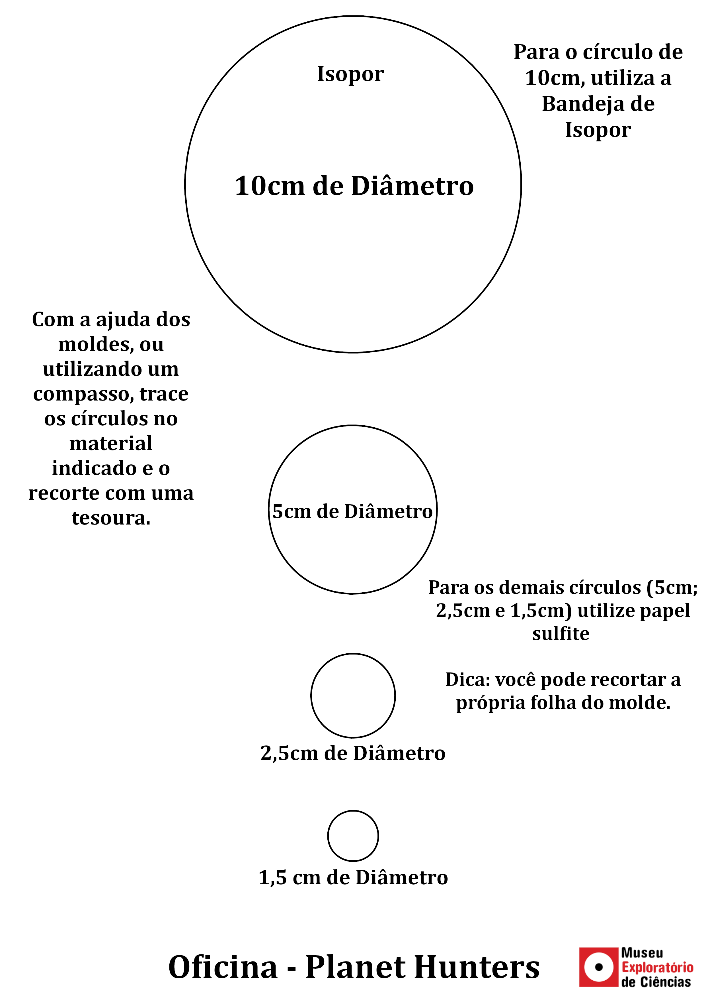

# Planet Hunters

## Apresentação

| |
| :----:|
|O Universo está repleto de planetas muito interessantes! Alguns são assustadores e outros têm características que vão muito além do que podemos imaginar!  Em nossa Galáxia já foram descobertos alguns milhares desses planetas, mas ainda há muito o que se explorar! Em “Planet Hunters” vamos aprender como encontrar esses mundos tão distantes! Preparados para a caçada!?”|

|“Você já pensou em viajar para um planeta com dois sóis? E um onde a vegetação é vermelha? Que tal visitar um planeta com um oceano de lava fervente? ||
| :----:|:----:|
|||

## Faixa Etária
Faixa etária indicada: 8 a 12 anos

(A equipe do Museu adora um desafio! Caso deseje agendar essa oficina para outra faixa etária, entre em contato que podemos trabalhar juntos em uma adequação de conteúdo.)

## Conceitos abordados e habilidades
Método científico, astronomia, geocentrismo e heliocentrismo, exoplanetas, método do trânisto planetário, experimentação.

## Lista de materiais:

* Bandejinha rasa de isopor (como as de supermercado) cortada em um círculo 10cm de diâmetro (molde abaixo)
* Três círculos de papel com os diâmetros 1.5 cm, 2.5 cm, 5.0 cm (molde abaixo)
* Duas folhas A4/sulfite quadriculadas 2x2 cm. Você mesmo pode preparar suas folhas quadriculadas ou imprimir usando 
[nosso modelo](./mold_grid_planet.png).
* Uma folha de Gráficos.  Você mesmo pode preparar sua folha de gráficos copiando ou imprimindo [nosso modelo](./graphs_planet_hunters.pdf).
* Duas folhas A4/brancas
* Uma superfície para apoiar as folhas (tipo prancheta)
* Tinta guache de cor escura (de preferência preta, mas pode ser marrom ou verde escuro)
* Pincel pequeno (para passar a tinta no isopor)
* Lápis ou caneta
* Régua

## Molde
_Imprima o molde abaixo em uma folha A4 na orientação retrato antes da oficina para construir as peças necessárias. (Clique com o botão direito do mouse em cima da imagem, depois "Salvar imagem como" para salvar o arquivo e conseguir imprimir o molde. Pequenas distorções das medidas são esperadas!)_

Exemplo dos círculos recortados

## Para mais informações entre em contato

* Por email: museu@unicamp.br
* Ou acesse o [Site Oficial do Museu](https://www.mc.unicamp.br/visite)

  <a href="https://www.facebook.com/mcunicamp/">
     
  <a href="https://www.instagram.com/mcunicamp/">
     
  <a href="https://www.tiktok.com/@mcunicamp">
    
