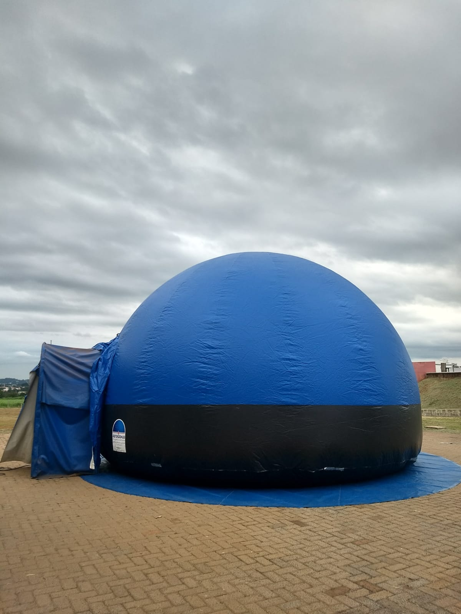

# Planetário Itinerante

## Disponível para agendamento de oficinas PRESENCIAIS

| |
|:------:
|A bordo do Planetário, conheça mais sobre  o universo e seus exploradores. Depois, ajuste o foco para a atividade de observação dos astros a olho nu, acompanhando uma carta celeste.|
|Descubra como a ciência olha para o universo e como busca explorar os seus mistérios. Viaje pelas estrelas e planetas na companhia da equipe do Museu Exploratório de Ciências.|

## Faixa Etária

|||
|:------:|:------:|
|Faixa etária indicada: a partir de 10 anos||

## Para mais informações entre em contato

* Por email museu@unicamp.br

* Ou acesse o [Site oficial do Museu](https://www.mc.unicamp.br/visite)
