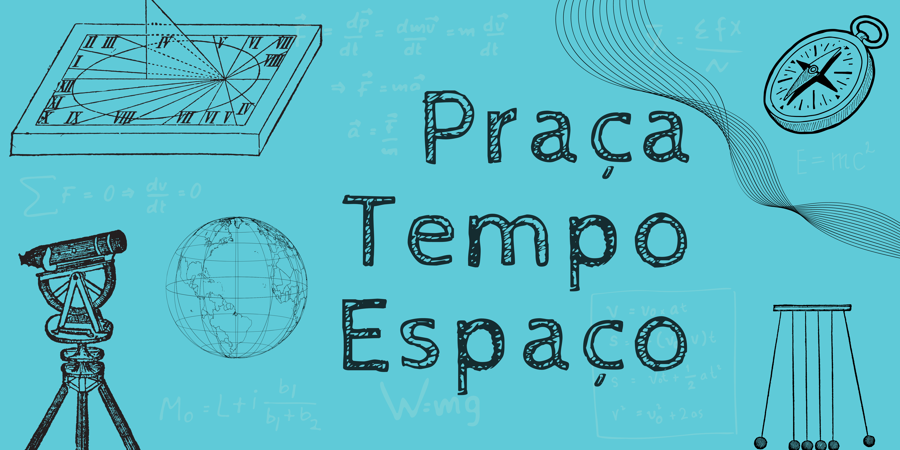
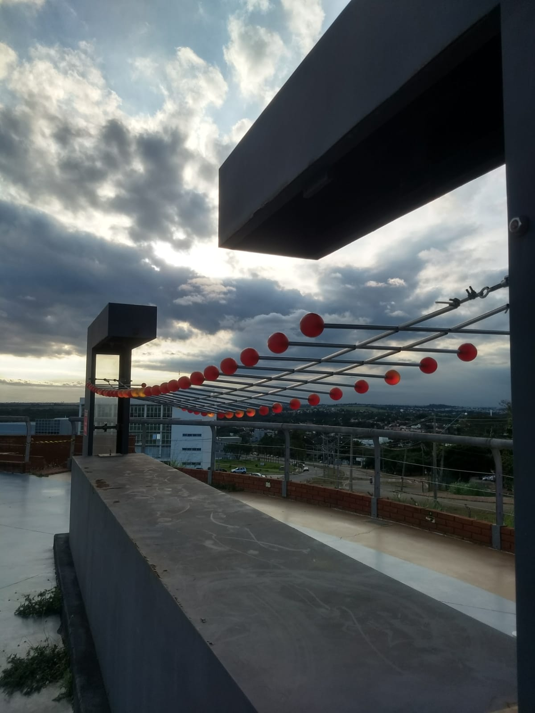
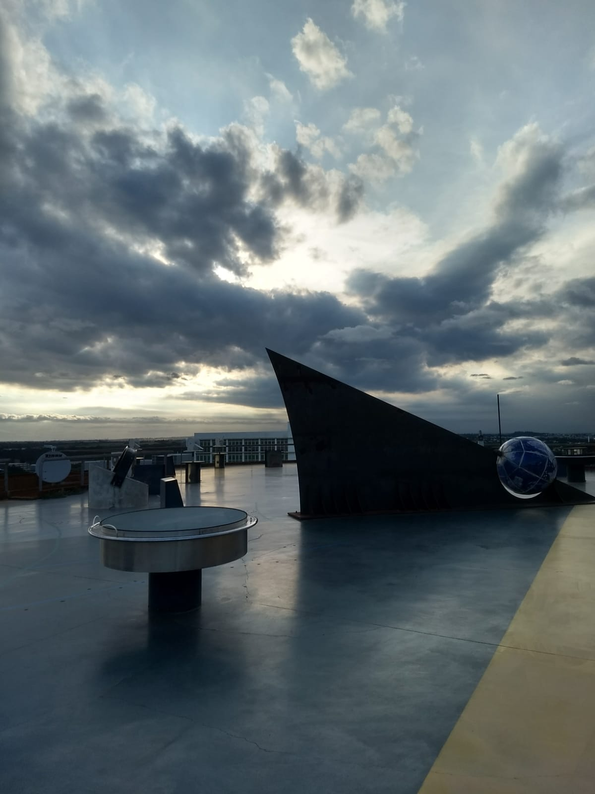
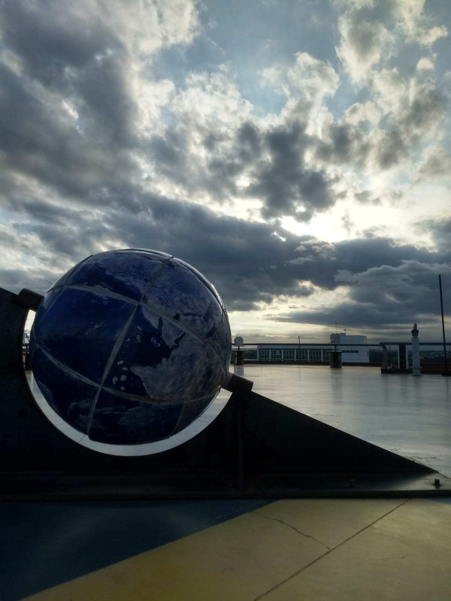
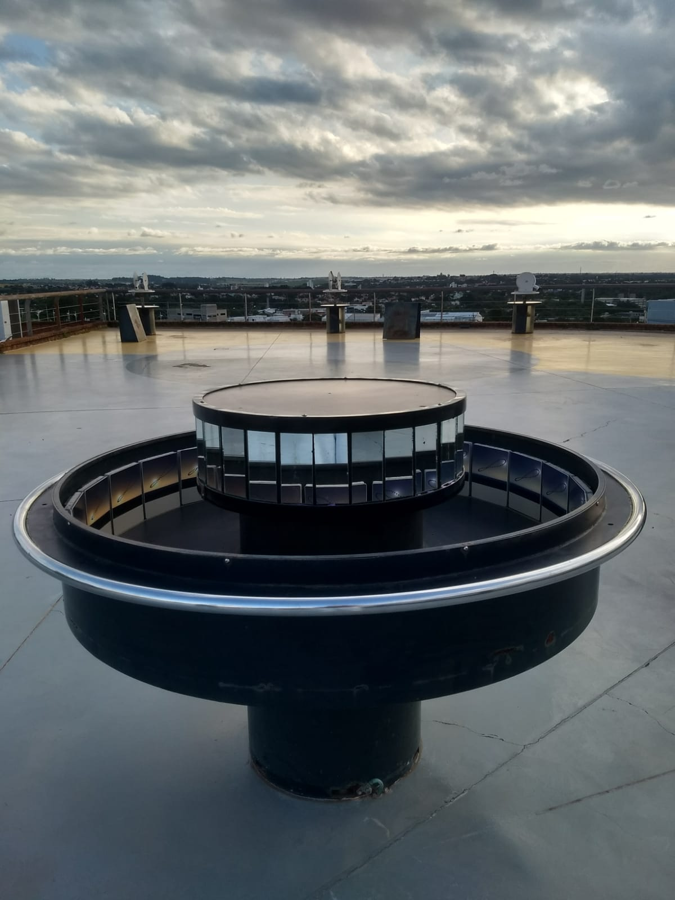
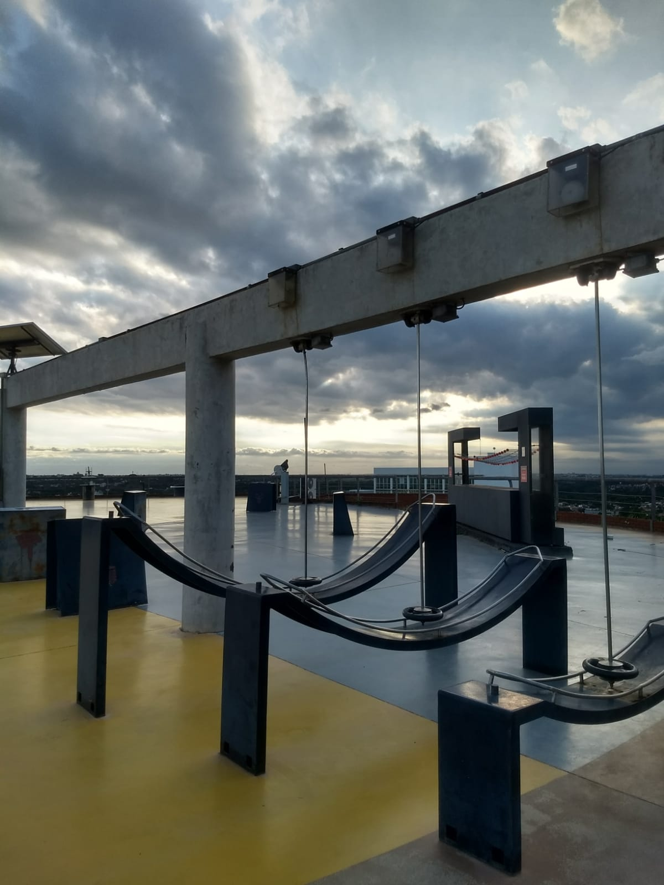
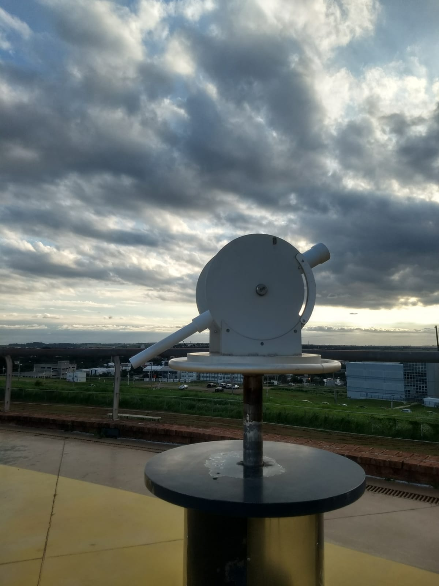
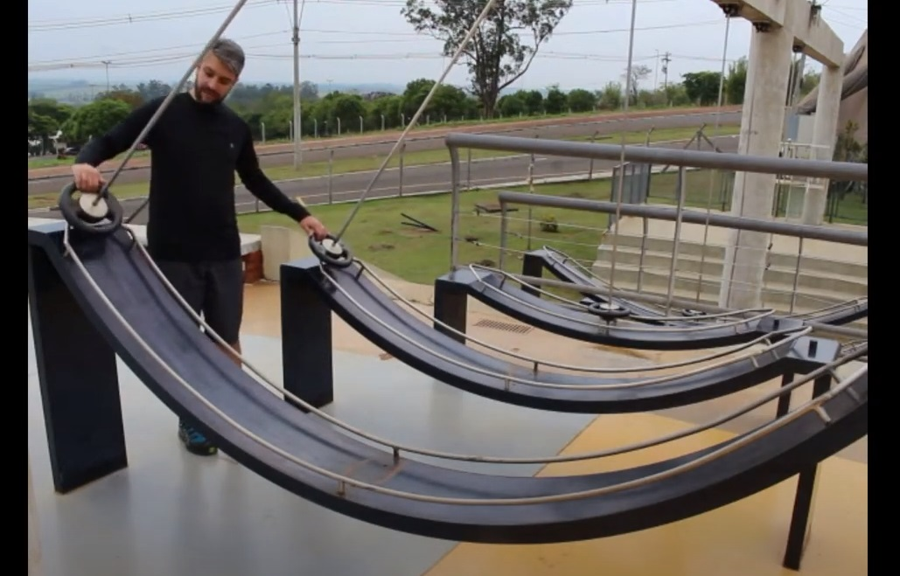

# Praça Tempo Espaço

## Oficina PRESENCIAL disponível para agendamento

| |
|:-------:|
||

## Faixa etária
Faixa etária indicada: qualquer idade.

## Conceitos abordados e habilidades
Sistema Terra, medições de tempo e espaço, energia, ondulatória, magnetismo, experimentação.

|||
|:------:|:------:|
|||
|||
|||

|Clique na imagem ao lado para ser redirecionado a playlist| |
|:----:|:-----:|
|||

## Para mais informações entre em contato

* Por email: museu@unicamp.br
* Ou acesse o [Site Oficial do Museu](https://www.mc.unicamp.br/visite)

  <a href="https://www.facebook.com/mcunicamp/">
     
  <a href="https://www.instagram.com/mcunicamp/">
     
  <a href="https://www.tiktok.com/@mcunicamp">
    
