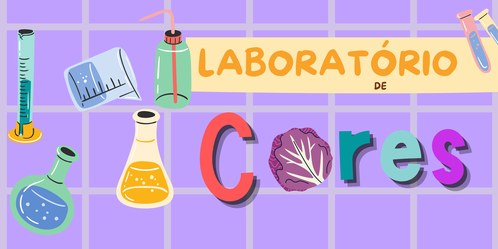
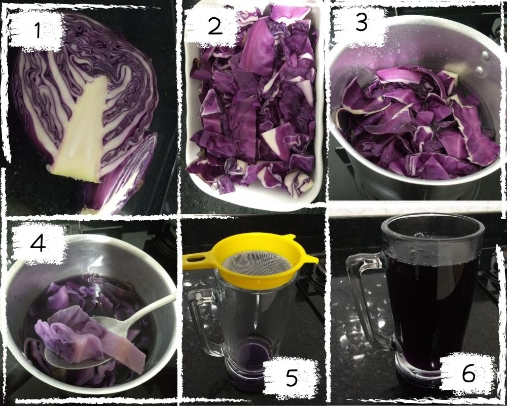

# Laboratório de cores

| |
| :------:|
|Nesta oficina você vai levar um laboratório de química para a sua casa. Aprenda a observar com outros olhos alimentos e substâncias do seu dia a dia, como descobrir detalhes sobre eles? Informações que vão além das apresentadas nas embalagens. |

### Ingredientes 

| ||
| :-----:|:------:|
|Repolho **ROXO**|Fermento químico|
|Suco de limão| Suco de laranja|
|Açúcar |Vinagre|
|Sabão em pó|Leite de Magnésia |
|Leite|Bicarbonato de sódio|
|Água|Shampoo |

* **Utensílios**: Colher; +/- 10 Copos plásticos; 1 Canudinho; Fita crepe.

**OBS**: Cada ingrediente será usado em pouca quantidade.                               
A falta de algum material (exceto o repolho roxo) não afeta o andamento da oficina.

- Antes da oficina deve ser preparado um chá com o repolho roxo, o passo-a-passo se encontra abaixo e deve ser realizado por um **adulto**

## Modo de preparo

### Chá de repolho roxo
* 1- Cortar repolho ao meio (vamos usar apenas uma metade)
* 2- Picar em tirinhas
* 3- Adicionar água e levar ao fogo
* 4- Deixar por mais ou menos 15min. (ou ate perder a cor, igual na imagem)
* 5- Coar
* 6- Reservar na galedeira até a hora do laboratório :)

