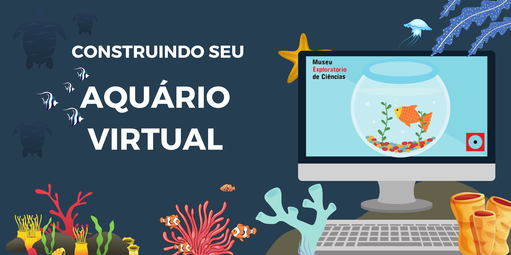
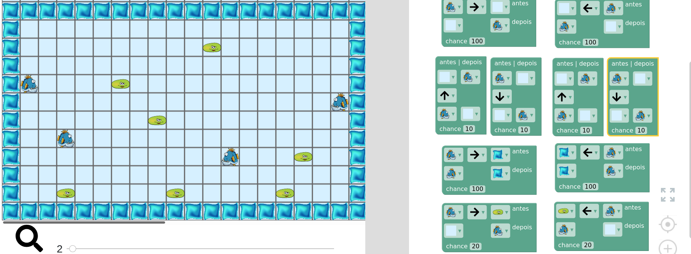
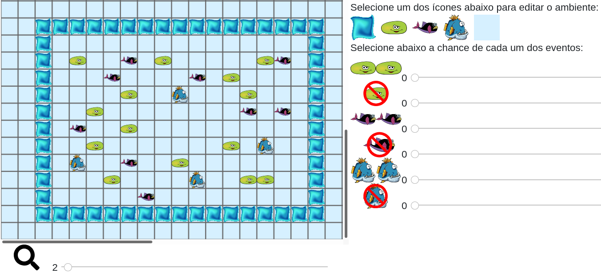

# Simulando um Aquário

|Construa um aquário virtual usando um programa de simulação e explore conceitos de cadeia alimentar, ecossistema e equilíbrio da vida.|
| :-----: |
| |
|Simule um interessante micromundo aquático escolhendo os mais variados tipos de habitantes, como plantas, peixes, herbívoros, carnívoros e diferentes seres marinhos. Prepare-se para o desafio de equilibrar a vida no ecossistema que você criou, ajustando a relação entre os diversos elementos.|

# Micromundos

Aprendendo sobre simulação em espaço celular:

