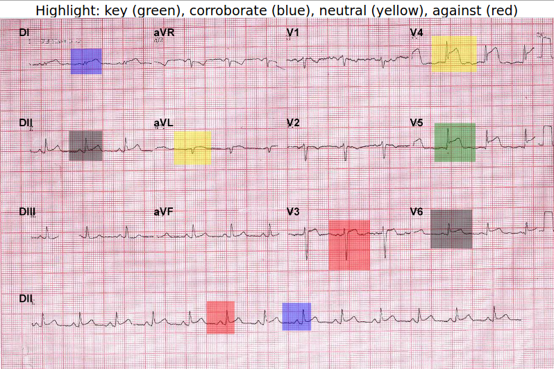
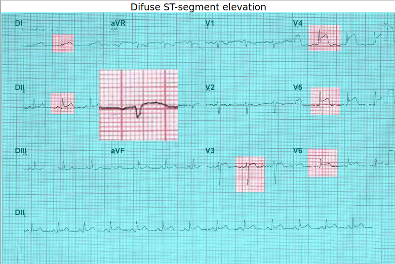
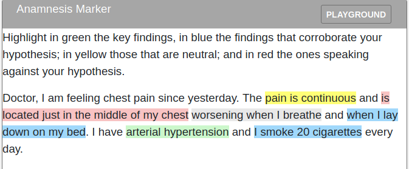
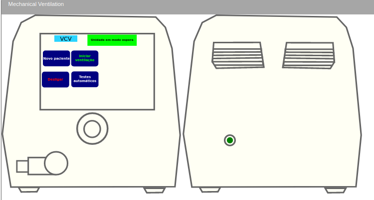

# DCC Gallery

## Electro Image Marker

Interactively marks the electrocardiogram.

Interactively presents the analysis of the electrocardiogram.

## Anamnesis Marker

Fragments independently highlighted.

Fragments highlighted in a group.

## Mechanical Ventilator

