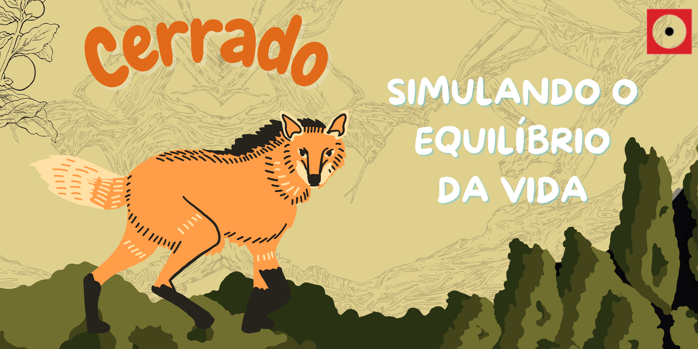
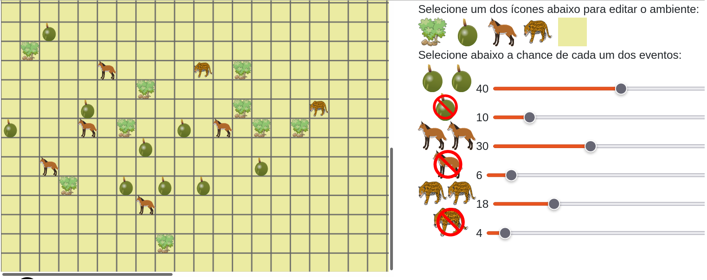

# Simulando o Equilíbrio da Vida - Cerrado

|  |
| :-----:|
|A Biologia continua ampliando nossa compressão sobre as impressionantes relações entre os mais diversos seres vivos e o ambiente. Nessa oficina utilizaremos um ambiente simulado para estudar e compreender uma dessas relações. Como a Terra é um sistema extremamente complexo, discutiremos a necessidade de simplificar nossa simulação e nos atentarmos para um local de estudo dentro das nossas capacidades de compreensão e processamento.
**Atenção**: para essa oficina é necessário ter acesso a um computador e conexão à Internet para cada participante. |

Nesta oficina, construiremos uma savana virtual usando um programa de simulação. Nessa savana, que representa o cerrado brasileiro, serão apresentados conceitos de cadeia alimentar, ecossistema e equilíbrio da vida. O participante será convidado a montar o seu cerrado, em que podem ser colocados um conjunto de espécies muito famosas, a lobeira ou fruta-do-lobo, o lobo-guará e a onça pintada, que serão os personagens virtuais para construção de um cerrado.  Dentre os desafios está aquele de construir uma savana interessante e também de equilibrar esse ecossistema.

## Faixa Etária

Faixa etária indicada: 7 a 10 anos

(A equipe do Museu adora um desafio! Caso deseje agendar essa oficina para outra faixa etária, entre em contato que podemos trabalhar juntos em uma adequação de conteúdo.)

## Conteúdos abordados e Habilidades
Biosfera, ecosfera, energia, cadeia alimentar, equilíbrio ecológico, simulações, formulação de hipóteses e raciocínio lógico.

## Simulador

**Aprendendo sobre simulação em espaço celular:**

##  Para mais informações entre em contato
* Por email museu@unicamp.br
* Ou acesse o [Site oficial do Museu](https://www.mc.unicamp.br/visite)
