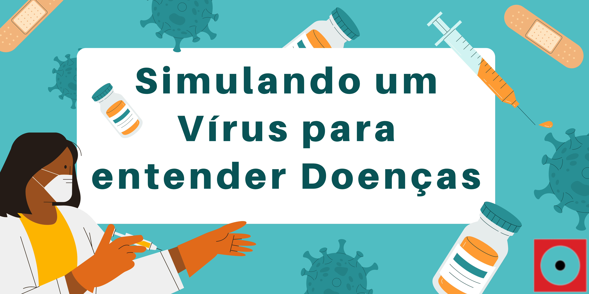
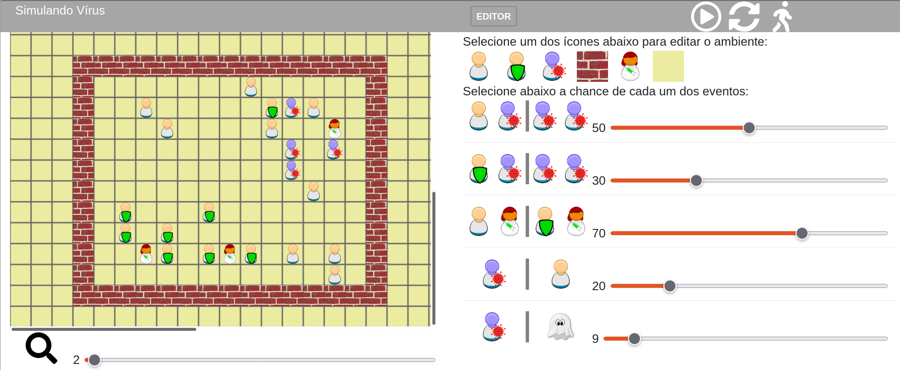

# Simulando um Vírus para entender Doenças

| |
| :------: |
|Trabalhe em um modelo de simulação e entenda como o recurso é importante para a Ciência, auxiliando na compreensão de fenômenos complexos, como a contaminação.  Vamos descobrir juntos como um vírus se espalha tão depressa, quais os efeitos do distanciamento social, do uso de máscaras e da vacina.|
**Atenção**: para essa oficina é necessário ter acesso a um computador e conexão à Internet para cada participante.|

## Faixa Etária

Faixa etária indicada:  8 a 10 anos.

(A equipe do Museu adora um desafio! Caso deseje agendar essa oficina para outra faixa etária, entre em contato que podemos trabalhar juntos em uma adequação de conteúdo.)

## Conceitos abordados e Habilidades
Vírus, doenças contagiosas, meios de contaminação, simulação.

### Aprendendo sobre simulação em espaço celular:

##  Para mais informações entre em contato
* Por email museu@unicamp.br
* Ou acesse o [Site oficial do Museu](https://www.mc.unicamp.br/visite)
