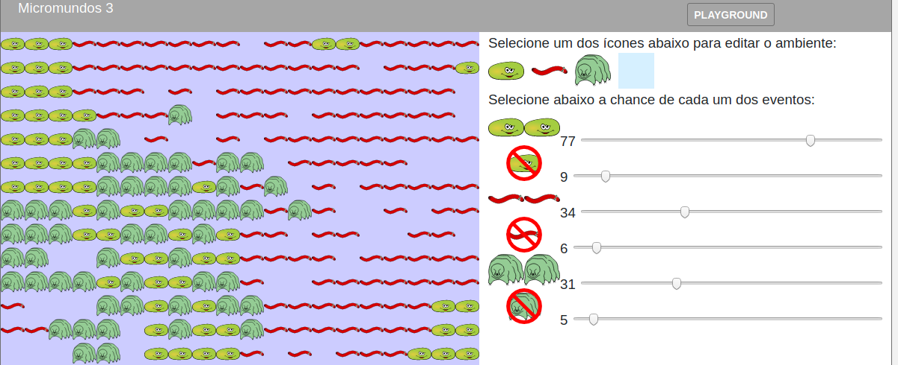

# Simulando Micro-organismos e o Equilíbrio da Vida

A Biologia continua ampliando nossa compressão sobre as impressionantes relações entre os mais diversos seres vivos e o ambiente. Nessa oficina utilizaremos um ambiente simulado para estudar e compreender uma dessas relações. Como a Terra é um sistema extremamente complexo, discutiremos a necessidade de simplificar nossa simulação e nos atentarmos para um local de estudo dentro das nossas capacidades de compreensão e processamento, no nosso caso uma parte dentro de uma EcoEsfera repleta de seres microscópicos maravilhosos. Os participantes são desafiados a colocar um micro-ecossistema em equilíbrio, podendo compreender e admirar a delicada relação entre os seres vivos, como esse equilíbrio nos afeta e como podemos ajudar a mantê-lo ou destruí-lo.

##Faixa Etária

Faixa etária indicada: 8 a 12 anos

(A equipe do Museu adora um desafio! Caso deseje agendar essa oficina para outra faixa etária, entre em contato que podemos trabalhar juntos em uma adequação de conteúdo.)

Aprendendo sobre simulação em espaço celular:

# Micromundos

## Imagens importadas e usadas no ambiente

* [Rocha](https://pixabay.com/vectors/rocks-stones-mining-soil-pebbles-155635/)
* [Areia](https://pixabay.com/vectors/template-pattern-seamless-blue-1099298/)
* [Vidro](https://pixabay.com/vectors/ball-balls-glass-glow-glowing-1293319/)
* [Balão](https://pixabay.com/vectors/balloon-blue-shiny-helium-happy-25734/)

* [Ondas](https://pixabay.com/vectors/blue-water-pattern-sea-tide-waves-309761/)

* [Árvores](https://pixabay.com/vectors/tree-environment-ecology-nature-146748/)
* [Planta](https://pixabay.com/vectors/sapling-plant-growing-seedling-154734/)

* [Bactéria Alien](https://pixabay.com/vectors/virus-alien-health-bug-medical-312665/)
* [Germe Verde](https://pixabay.com/vectors/germ-virus-bacteria-infection-308922/)

* [Brontossauro](https://pixabay.com/vectors/brontosaurus-dinosaurs-extinct-37797/)
* [Dinossauro Carnívoro](https://pixabay.com/vectors/cartoon-comic-dino-dinosaur-green-1299393/)

* [Proibido](https://pixabay.com/vectors/no-symbol-prohibition-sign-39767/)
* [Flechas](https://pixabay.com/vectors/arrow-direction-turn-set-left-36877/)
