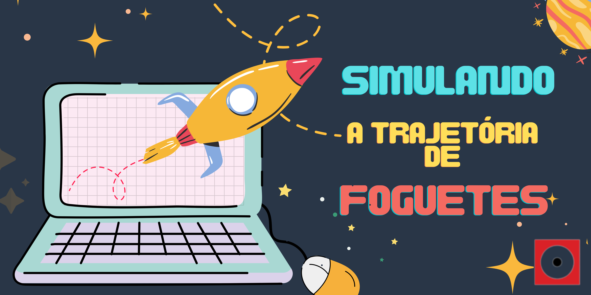
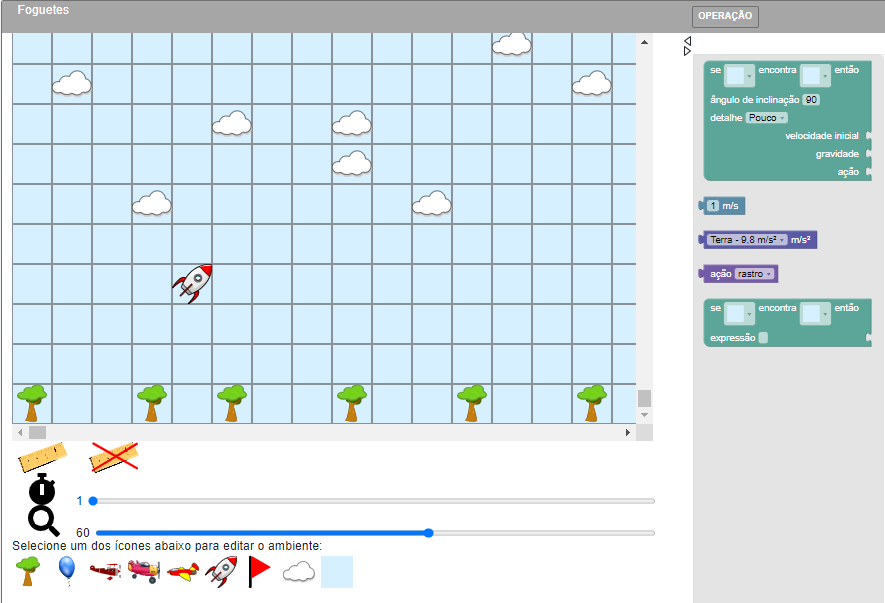

## Simulando a trajetória de foguetes

|Você seria capaz de prever a trajetória de um foguete?|
|:------:|
|  |
|Aprenda a configurar um simulador virtual, combine diferentes ângulos de lançamento com diversas velocidades de voo e surpreenda-se alcançando resultados similares aos obtidos em experimentos reais.Na oficina, atue como um(a) cientista, realizando testes, observando o comportamento dos foguetes e usando as informações para corrigir erros e ajustar o projeto.
**Atenção**: Para essa oficina é necessário ter acesso a um computador e conexão à Internet para cada participante.|

## Conceitos abordados e habilidades
Simulações, lançamento oblíquo, gravidade, velocidade, ângulos, formulação de hipóteses, experimentação.

## Faixa Etária

Faixa etária indicada: 10 a 13 anos

*(A equipe do Museu adora um desafio! Caso deseje agendar essa oficina para outra faixa etária, entre em contato que podemos trabalhar juntos em uma adequação de conteúdo.)*

## Simulador

Aprendendo sobre simulação em espaço celular:

##  Para mais informações entre em contato
* Por email museu@unicamp.br
* Ou acesse o [Site oficial do Museu](https://www.mc.unicamp.br/visite)

  <a href="https://www.facebook.com/mcunicamp/">
     
  <a href="https://www.instagram.com/mcunicamp/">
     
  <a href="https://www.tiktok.com/@mcunicamp">
    
