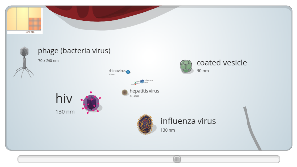

# Vírus de Papel

Esta oficina envolve a construção em conjunto de um micromundo de papel para estudar os vírus, as células e como acontece o contágio. A atividade mescla montagem de vírus em papel e um mega desenho de chão da célula, onde vamos construir uma narrativa de como acontece a relação entre um vírus e uma célula.

## Faixa Etária

Faixa etária indicada: 6 a 9 anos ou 10 a 12 anos

(A equipe do Museu adora um desafio! Caso deseje agendar essa oficina para outra faixa etária, entre em contato que podemos trabalhar juntos em uma adequação de conteúdo.)

## Entendendo um Vírus

### Tamanho do Vírus

### Variedade dos Vírus

### Como um Vírus entra na Célula

#### 3D

## Vírus se Replicando

